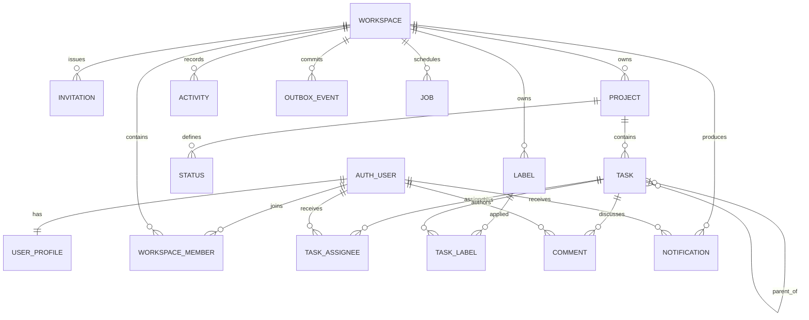

# Launch++ data and API architecture

Status: proposed logical model and public API conventions. Physical migrations and generated schemas do not exist yet.

## Design goals

- Keep core records relational, explicit, and easy to export.
- Enforce workspace ownership and authorization in every access path.
- Use one write model for board, list, search, activity, plugins, and future clients.
- Make concurrent edits detectable rather than silently overwriting them.
- Commit domain changes and durable follow-up work atomically.
- Give plugins useful typed storage without exposing SQL or core tables.
- Keep wire contracts independent of React, Fastify internals, and the ORM.
- Support a verified move from local SQLite to a VPS using the same logical model.

## Persistence strategy

SQLite is the initial system of record. It runs with:

- Foreign keys enabled on every connection.
- Write-ahead logging on a local filesystem.
- A measured busy timeout.
- Short write transactions.
- Explicit indexes reviewed with representative query plans.
- Controlled checkpoints and online backup through the SQLite backup API or a tested equivalent.
- Integrity checks as part of backup verification and diagnostics.

Drizzle defines physical tables and typed queries, but application modules depend on repository ports. Production schema changes are committed, ordered SQL migrations. Runtime `push` or automatic destructive synchronization is prohibited.

## Data conventions

| Concern | Convention |
| --- | --- |
| IDs | Opaque lowercase UUIDv7 strings generated by the host |
| Human task references | Project key plus transactionally allocated number, for example `APP-42` |
| Timestamps | UTC instants at the API boundary; integer epoch milliseconds in SQLite unless a table documents otherwise |
| Calendar dates | ISO `YYYY-MM-DD`, independent of time zone |
| Booleans | SQLite integer with schema checks, mapped to TypeScript boolean |
| Enumerations | Text with application/schema checks; unknown wire values are not silently accepted |
| Absence | Explicit `null` when the schema permits it; omitted fields have patch semantics only where documented |
| Revisions | Monotonically increasing integer on mutable aggregate roots |
| Money | Integer minor units plus ISO currency if a future plugin needs it; never floating point |
| JSON | Only for bounded settings, event payloads, and typed extension data; not a replacement for core relational columns |
| Names | Unicode text normalized for comparison where needed, preserving the user's original display form |

IDs are never parsed for authorization or business meaning. UUIDv7 provides useful locality, but ordering always uses an explicit business field or timestamp plus ID tie-breaker.

## Core logical model



This is a logical ownership diagram, not generated migration syntax. Authentication tables are owned by Better Auth; all authorization and project-management tables are owned by Launch++.

## Core tables and invariants

### Authentication and profile

Better Auth owns its user, session, linked account, and verification tables. Launch++ stores application-specific profile preferences separately where possible.

`user_profiles`

- `user_id` — primary/foreign key to the auth user
- `display_name`
- `avatar_asset_id`, nullable
- `locale`
- `time_zone`
- `current_workspace_id`, nullable — the user's selected active workspace
- `created_at`, `updated_at`, `revision`

Authentication schema changes are generated/reviewed alongside application migrations. An auth library migration is never run independently against production without backup and compatibility tests.

### Workspaces and membership

`workspaces`

- `id`, `slug`, `name`
- `created_by_user_id`
- `created_at`, `updated_at`, `archived_at`, `deleted_at`
- `revision`

`workspace_members`

- `workspace_id`, `user_id` — composite primary key
- `role` — `owner`, `admin`, or `member`
- `state` — `active` or `suspended`
- `joined_at`, `updated_at`

`workspace_invitations`

- `id`, `workspace_id`, normalized `email`, intended `role`
- `token_hash`, never the raw invitation token
- `invited_by_user_id`, `expires_at`, `accepted_at`, `revoked_at`

Invariants:

- Every active workspace has at least one owner.
- The final owner cannot leave, be removed, or be demoted without an ownership transfer.
- Workspace slugs are unique within an installation for clean URLs, but APIs use the immutable ID.
- Membership changes invalidate relevant sessions/query scopes and produce audit activity.

### Projects and statuses

`projects`

- `id`, `workspace_id`
- `key` — short uppercase human prefix unique in the workspace
- `slug`, `name`, `description`
- `access` — `workspace` initially; `restricted` reserved for the later project-membership feature
- `next_task_number`
- `created_by_user_id`
- `created_at`, `updated_at`, `archived_at`, `deleted_at`
- `revision`

`project_statuses`

- `id`, `workspace_id`, `project_id`
- `name`, `color`, optional `icon`
- `position`
- `category` — `backlog`, `active`, or `done`
- `created_at`, `updated_at`, `archived_at`
- `revision`

Invariants:

- A status and task always belong to the same workspace and project.
- A project retains at least one active status while active tasks exist.
- Removing a used status requires moving its tasks in the same transaction or archiving the status.
- `next_task_number` is incremented in the task-creation transaction; numbers are never reused.
- Archiving hides a project from ordinary navigation without deleting it or its extension data.

### Tasks

`tasks`

- `id`, `workspace_id`, `project_id`, `number`
- `parent_task_id`, nullable
- `status_id`
- `title`, `description_markdown`
- `due_date`, nullable ISO date
- `position` — ordered rank within its current parent/status projection
- `created_by_user_id`, `updated_by_user_id`
- `created_at`, `updated_at`, `archived_at`, `deleted_at`
- `revision`

`task_assignees`

- `workspace_id`, `task_id`, `user_id`
- `assigned_by_user_id`, `assigned_at`
- unique on task/user

`labels`

- `id`, `workspace_id`, optional `project_id`
- `name`, normalized comparison key, `color`
- `created_at`, `updated_at`, `archived_at`, `revision`

`task_labels`

- `workspace_id`, `task_id`, `label_id`, `applied_at`, `applied_by_user_id`
- unique on task/label

Invariants:

- Parent and child task are in the same workspace and project.
- v1 supports one subtask level; a task with a parent cannot itself be a parent.
- A task's assignees are active members of its workspace and allowed in the project.
- Project-scoped labels cannot be attached outside their project.
- A due date is a calendar date. Due-time reminders are a later capability or plugin.
- Board and list reads query the same task rows; a move never copies a task between view-specific tables.
- Moving a task between projects is a dedicated command that validates status, labels, plugin data, and numbering; it is not a normal patch.

### Ordered positions

Statuses and tasks use opaque rank strings or another fractional-order representation so most moves update only the moved record. Clients never invent arbitrary final ranks: they send neighboring IDs or a documented before/after intent, and the server computes the position.

When rank space becomes too dense, a bounded maintenance operation rebalances one list under a short write lock. Ordering always uses `position, id` for deterministic ties.

### Comments

`comments`

- `id`, `workspace_id`, `task_id`
- `author_user_id`
- `body_markdown`
- `created_at`, `updated_at`, `deleted_at`
- `revision`

Comment edits preserve authorship and generate activity. A recoverably deleted comment retains a tombstone visible according to policy; permanent deletion follows workspace retention. Mention parsing produces notification work after commit and cannot block saving the comment.

### Activity and audit

`activities`

- `id`, `workspace_id`
- optional `project_id`, `task_id`
- `actor_type`, `actor_id`
- `action`, `subject_type`, `subject_id`
- bounded `summary_data`
- `occurred_at`, `causation_id`, optional `source_plugin_id`

Activity is an append-oriented human history created from successful domain changes. It is not the canonical event store and does not reconstruct state. Summary data contains stable display facts needed to explain the action while sensitive live details are loaded under current permissions.

Security-relevant installation and permission changes additionally write a separate audit stream with stricter retention and operator visibility, described in the security document.

The initial `audit_entries` table records installation/workspace scope, actor, operation, target, outcome, bounded JSON metadata, occurrence time, and correlation ID. First-owner setup and workspace creation write these audit facts in the same transaction as their domain state.

### Notifications

`notifications`

- `id`, `workspace_id`, `recipient_user_id`
- `type`, bounded `data`
- `created_at`, `read_at`, optional `emailed_at`
- `source_event_id`

Notifications are derived delivery records. Rebuilding or losing a non-critical derived notification must not corrupt domain state. Uniqueness on recipient/source/type prevents duplicate at-least-once delivery from creating repeated notifications.

## Platform records

### Outbox and jobs

`outbox_events`

- `id`, `workspace_id`, `type`, `version`
- `aggregate_type`, `aggregate_id`, `aggregate_revision`
- `actor_type`, `actor_id`, `source_plugin_id`
- `causation_id`, `correlation_id`
- validated `payload`
- `occurred_at`, `available_at`
- dispatch state and retention metadata

`event_deliveries`

- `id`, `event_id`, `consumer_id`
- `state`, `attempts`, `available_at`
- `lease_owner`, `lease_expires_at`
- `last_error_code`, bounded redacted error detail
- unique on event/consumer

`jobs`

- `id`, `workspace_id`, owner type/ID
- `type`, `version`, validated `payload`
- `state`, `priority`, `available_at`
- `attempts`, `max_attempts`
- `lease_owner`, `lease_expires_at`
- optional schedule/missed-run policy
- `created_at`, `completed_at`, `cancelled_at`

`idempotency_records`

- scope: installation/workspace/actor/plugin/command
- `key`, validated input hash
- state and stored response/status
- `created_at`, `expires_at`
- unique on full scope/key

Outbox rows are written in the domain transaction. Delivery rows may be expanded eagerly or lazily but must have deterministic consumer IDs. A lease expiry makes abandoned work eligible for retry. Retention keeps diagnostics long enough to cover the documented replay window.

### Preferences

`user_preferences` and `project_view_preferences` contain bounded typed JSON validated by application-owned schemas. Examples include active theme, board density, visible list columns, saved local filters, and last project. Preferences never carry domain truth such as task status or plugin grants.

### Assets

`assets`

- `id`, owner scope and parent reference
- `kind`, original name, media type, byte size
- content digest and storage key
- creator, created timestamp, deletion state

Bytes live behind an asset-store port; metadata and authorization live in SQLite. Uploads stream to quarantine, enforce size/type limits, hash content, and become visible only after successful validation. Attachments are not required in the first vertical slice.

## Extension data

The public authoring and evolution contract is defined in [plugin-storage-design.md](./plugin-storage-design.md). Plugin authors describe collections in `data/schema.ts`; the host compiles/installs a static schema and owns all physical persistence. Plugins receive neither SQL nor an ORM/database connection.

The plugin document defines lifecycle semantics. Logical records include:

- `plugin_packages` — immutable manifest, version, digest, provenance, signature status, package location.
- `installation_plugins` — operator allow/deny state and package availability.
- `workspace_plugins` — selected version, grants, enablement, installed schema digest, health.
- `project_plugins` — project activation and non-secret settings.
- `plugin_field_definitions` and `plugin_field_values` — typed native extensions to core entities.
- `plugin_collection_definitions` and `plugin_records` — namespaced private storage with declared indexes.
- `plugin_secret_references` — metadata only; ciphertext belongs to the vault.
- `plugin_invocations` — bounded diagnostic history, timings, result state, and redacted failure.

Every plugin record is automatically scoped by workspace and plugin identity. Parent-scoped records use host-maintained relations so access, moves, archive, retention, and export do not depend on copied IDs supplied by plugin code.

Plugin JSON schemas and data are bounded by depth, property count, string size, total record size, index count, and query limits. Arbitrary recursive or computationally expensive schemas are rejected during package validation. Plugin packages contain no SQL, database drivers, or author-maintained migration files.

## Theme data

- `theme_sources` — immutable source JSON or installed package reference, identity, version, digest.
- `installed_themes` — installation availability and provenance.
- `workspace_theme_defaults` — workspace recommendations/default family.
- `user_theme_preferences` — explicit theme or follow-system selection.

Resolved CSS is derived and cacheable; the source plus schema version remains canonical. A theme does not receive tables, secrets, or executable records.

## Query and index design

Initial indexes should cover actual access paths:

- Membership by user and workspace.
- Projects by workspace, archive state, and normalized name/key.
- Statuses by project and ordered position.
- Tasks by project/status/position, project/update time, assignee joins, label joins, parent, due date, and deletion state.
- Comments by task and creation order.
- Activity by workspace/project/task and reverse occurrence order.
- Notifications by recipient/read state and reverse creation order.
- Outbox/deliveries/jobs by runnable state and `available_at`.
- Plugin records by namespace, parent, collection, and declared bounded indexes.

Every list query uses cursor pagination. Offset pagination is reserved for small administrative tables where concurrent insertion cannot create harmful user confusion.

Before a release, representative datasets and `EXPLAIN QUERY PLAN` output are checked for the board, list, task detail, search, activity, job lease, and plugin collection queries. An ORM abstraction is not evidence that a query is efficient.

## Search architecture

SQLite FTS5 provides the initial search index for projects, tasks, and optionally comments. Search is a derived index, never the authorization source.

The indexing pipeline is:

1. A domain write commits an outbox fact.
2. The search consumer loads the current permission-relevant document.
3. It upserts or deletes the corresponding FTS row.
4. Search queries retrieve candidate IDs from FTS.
5. A relational query joins those IDs to current workspace/project visibility before returning results.

The client may briefly see eventual search lag after a mutation, while direct task views remain immediately consistent. An operator can rebuild the index entirely from core tables. Plugin fields become searchable only if their declaration permits it and their type has a supported tokenizer/normalizer.

## HTTP API design

### General form

- Base path: `/api/v1`
- JSON media type for ordinary endpoints
- `application/problem+json` for errors
- Same-origin secure cookie session for the web app
- Opaque cursor pagination
- OpenAPI generated from the same trusted schemas used by Fastify
- Generated internal TypeScript client consumed by the web app
- Explicit deprecation headers and release notes for retiring behavior

Authentication handlers may live under `/api/auth/*` according to the auth adapter. They do not define workspace authorization.

### Proposed resource families

| Area | Representative endpoints |
| --- | --- |
| Session/profile | `GET /me`, `PATCH /me`, `GET /me/workspaces` |
| Workspaces | `POST /workspaces`, `GET/PATCH /workspaces/:id`, archive/restore/export operations |
| Membership | list, invite, accept, change role, suspend/remove |
| Projects | list/create/get/patch/archive/restore |
| Statuses | list/create/patch/reorder/archive |
| Tasks | list/create/get/patch/archive/restore, assign, label, reorder/move |
| Comments | list/create/patch/delete/restore |
| Activity | workspace/project/task feeds |
| Search | scoped query with typed result families |
| Notifications | list, unread count, mark read |
| Plugins | upload/stage, inspect, approve, enable, configure, update, disable, export data, purge |
| Themes | import, preview, install, select, remove |
| Events | authenticated SSE stream |
| Administration | health details, diagnostics, backup/restore coordination under operator policy |

Endpoint names are provisional until route schemas are implemented. Dedicated action endpoints are preferable when an operation has meaningful invariants—such as moving a task between projects, transferring ownership, or enabling a plugin—rather than hiding the operation in a generic patch.

### Example task response

```json
{
  "id": "01995cd8-7854-7b10-9ea8-a22f504c18b8",
  "workspaceId": "01995cd6-b694-7e78-83d8-6454c38daa46",
  "projectId": "01995cd7-421b-7cb1-899d-9a0136b9e271",
  "reference": "APP-42",
  "title": "Design plugin permission review",
  "description": "Document the installation flow.",
  "status": {
    "id": "01995cd7-89df-7d7f-978a-710a1678bb10",
    "name": "In progress"
  },
  "assignees": [],
  "labels": [],
  "dueDate": "2026-09-30",
  "revision": 7,
  "createdAt": "2026-09-17T09:12:31.284Z",
  "updatedAt": "2026-09-17T10:08:12.912Z"
}
```

### Partial updates

Patch schemas enumerate permitted fields and distinguish absent from `null`. A generic JSON Patch document is not used for core resources in v1; explicit typed patch inputs produce clearer authorization and API documentation.

The client sends an `If-Match` ETag or `expectedRevision`. A mismatch returns a typed `409 Conflict` or `412 Precondition Failed` with the current revision and a safe refetch hint. The server never accepts last-write-wins silently for collaborative mutable records.

### Errors

Errors use stable machine codes inside a problem-details envelope:

```json
{
  "type": "https://launchpp.dev/problems/revision-conflict",
  "title": "The task changed before this update was saved",
  "status": 409,
  "code": "TASK_REVISION_CONFLICT",
  "requestId": "req_01995cdb",
  "details": {
    "resourceId": "01995cd8-7854-7b10-9ea8-a22f504c18b8",
    "expectedRevision": 6,
    "currentRevision": 7
  }
}
```

Validation errors include field paths and stable reasons. Production responses do not expose SQL, stack traces, filesystem paths, secrets, raw plugin exceptions, or whether an inaccessible resource exists. Logs retain a correlation ID and redacted diagnostic detail.

### Pagination

```json
{
  "items": [],
  "page": {
    "nextCursor": "opaque-signed-or-encoded-cursor",
    "hasMore": false
  }
}
```

A cursor binds to the sort fields, last record ID, workspace, and normalized filter shape. It is not trusted for authorization. Changing filters starts a new cursor. Default and maximum page sizes are route-specific and enforced server-side.

### Idempotency

Create endpoints, plugin commands, imports, and high-value batch operations accept `Idempotency-Key`. The server binds a key to actor, workspace, operation, and a hash of validated input. Reusing the key with different input is an error; replaying identical input returns the stored result during the documented retention window.

Simple patches also use revision preconditions. Idempotency prevents duplicate effects after retry; revision checks prevent lost concurrent updates. They solve different problems.

### Batch operations

Batch endpoints have explicit maximum sizes and per-item results. Atomic batches are available only when all effects can be validated and committed in one short transaction. Otherwise the API exposes a durable job with progress and cancellation semantics; it does not pretend a distributed or external batch can roll back.

## Real-time invalidation

The web client opens one authenticated SSE connection per active browser session:

```text
GET /api/v1/events?workspaceId=<id>
Accept: text/event-stream
Last-Event-ID: <cursor>
```

The server emits small versioned envelopes:

```json
{
  "id": "evt_01995ce1",
  "type": "task.updated",
  "version": "1",
  "workspaceId": "01995cd6-b694-7e78-83d8-6454c38daa46",
  "resource": {
    "type": "task",
    "id": "01995cd8-7854-7b10-9ea8-a22f504c18b8",
    "revision": 8
  }
}
```

The envelope normally tells the client what became stale; it does not stream a full task containing fields the current connection may no longer access. The server rechecks membership on connection, periodically, and on relevant membership events. Revocation closes the stream and ordinary refetches return authorization errors.

Clients reconnect with exponential backoff and `Last-Event-ID`. If retained history cannot cover the cursor, the server sends a reset signal and the client invalidates workspace queries. SSE is an optimization for freshness, not a condition for correctness.

## Internal and plugin contracts

Core domain events and public plugin events are not automatically the same payload. An event mapper converts internal facts into versioned, permission-filtered public contracts. This prevents internal table changes from becoming plugin breaking changes and prevents sensitive fields from leaking to subscribers.

Plugin commands enter through the same application service boundary as HTTP. They carry an actor/service identity, plugin identity, enabled scope, declared capability, correlation ID, deadline, and idempotency key. They cannot invoke a repository directly.

## Deletion and retention

Deletion is explicit:

- **Archive** hides an active entity but preserves normal restore and references.
- **Recoverable delete** hides it from normal use for a configured retention period.
- **Permanent purge** removes the core entity and cascades host-linked extension data after retention and authorization checks.

The initial default recoverable retention can be 30 days, but it remains configurable installation policy and must be shown to operators. Workspace deletion requires ownership confirmation, a recovery window, and a final purge job. Legal-hold and enterprise retention are later policies.

Plugins cannot preserve hidden copies of purged parent data through parent-scoped storage. External systems may already have received data through an approved integration; the uninstall/export UI must explain this boundary.

## Migrations

### Core migrations

- Every migration has an immutable ID and checksum.
- The server refuses to run against an unknown newer schema.
- Production startup does not invent schema changes from current TypeScript definitions.
- Destructive transformations use expand/migrate/contract where practical.
- Large rewrites run in bounded batches with progress and disk-space checks.
- A pre-upgrade backup is required for migrations classified as non-trivial.
- Rollback means restoring a compatible application and data state, not merely deploying old code over a new schema.

### Plugin schema evolution

Plugin data does not use author-written migrations. The host compares the installed canonical schema digest with the uploaded target and classifies every change.

Safe additive changes—such as optional/defaulted fields, new collections, enum expansion and compatible indexes—are prepared automatically under a workspace/plugin lock. Defaults are resolved lazily when possible. Stable collection/field IDs and deprecation preserve old data.

Destructive or ambiguous changes—such as removing stored fields, changing a type in place, narrowing constraints over incompatible data, changing ownership/scope or adding uniqueness over duplicates—are rejected before activation. A small host-owned catalog may later perform explicit previewed conversions, but uploaded plugins never execute arbitrary transformation code or SQL against storage.

Preparation stages metadata/index work and validates existing records before activation. Failure leaves the prior package/schema active. The old version remains available until compatibility and staged health checks succeed. Core schema and another plugin's data remain inaccessible throughout.

## Backup, export, and import

### Installation backup

A full backup contains:

- A transactionally consistent SQLite snapshot
- Package archives and required static assets
- User-uploaded asset bytes
- Encrypted secrets plus separately protected key material, when disaster recovery requires them
- Installation configuration needed to restore paths and policies
- A manifest with application/schema versions and content digests

Copying only the main SQLite file while WAL writes are active is not a supported backup procedure.

### Portable workspace export

A workspace export contains versioned, portable records:

- Workspace, project, task, comment, label, membership reference, and settings data
- Plugin enablement, manifest identity, compiled schema digests, fields, and plugin records
- Theme selection metadata
- Optional eligible assets
- Stable IDs and referential relationships
- Checksums and an export manifest

It omits password/session data, raw invitation tokens, server configuration, and secrets. Imported integrations require reconnection. Plugin archives may be included only according to package license and trust policy; importing data never executes them automatically.

Import validates the complete archive into a staging area, resolves identity/member mapping, reports conflicts, writes under one coordinated import operation, and activates only after integrity checks. A failed import leaves the target workspace absent or clearly staged, never half-usable.

## PostgreSQL evolution criteria

PostgreSQL work begins only if at least one measured requirement cannot be met safely by the supported SQLite topology:

- Sustained write contention exceeds the documented latency budget.
- A hosted offering requires multiple concurrent API writers or high availability.
- Dataset/index size makes backup, checkpoint, or search operations unsuitable.
- Operational requirements demand managed database replication and point-in-time recovery.

The migration requires a real adapter, dual-dialect migration strategy, behavior tests, and an export/import or controlled cutover tool. Avoid writing least-common-denominator SQL today solely to claim theoretical portability.

## Data architecture acceptance criteria

- [ ] Every core row is traceable to an owning workspace or installation scope.
- [ ] Cross-workspace foreign references are rejected by service and database constraints where practical.
- [ ] Board and list show the same task state after every supported mutation.
- [ ] Concurrent task edits produce a structured conflict, not silent data loss.
- [ ] Task mutation and outbox fact survive or roll back together.
- [ ] Search results never bypass current authorization and can be rebuilt from source data.
- [ ] Duplicate command/event delivery does not duplicate a protected local effect.
- [ ] Plugin storage cannot query another plugin namespace or forge parent access.
- [ ] Plugin authors add/evolve collections without SQL or migration files; unsafe schema changes are rejected before data changes.
- [ ] A live backup restores into an integrity-checked usable installation.
- [ ] Workspace export/import preserves IDs, relations, dormant plugin data, and version metadata.
- [ ] Permanent parent deletion removes host-linked plugin data according to retention policy.
- [ ] All list endpoints enforce bounded cursor pagination and indexed access paths.
