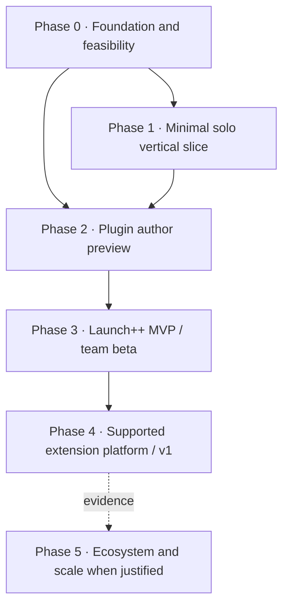

# Launch++ implementation roadmap

Status: active execution plan derived from the accepted product and architecture documents.

This document turns the target architecture into ordered phases and checkable tasks. It is the delivery-level source of truth; subsystem documents remain authoritative for their contracts. Relevant inputs are the [product scope](./product-scope.md), [system architecture](./system-architecture.md), [plugin system](./plugin-system-design.md), [plugin UI system](./plugin-ui-system.md), [plugin storage](./plugin-storage-design.md), [plugin CLI](./plugin-cli-design.md), [theme system](./theme-system-design.md), [security and operations](./security-and-operations.md), and [development guide](./development-and-delivery.md).

## Outcome and release boundary

Launch++ v1 is complete when a new user can install the application, create an account and project, manage tasks through Board and List, invite a small team, and safely install or develop useful plugins without touching application internals or a database.

The roadmap separates five meaningful release points:

| Milestone | Completion point | Intended use |
| --- | --- | --- |
| Technical foundation | Phase 0 | Internal architecture and feasibility proof |
| Core alpha | Phase 1 | Solo daily project-management testing |
| Plugin author preview | Phase 2 | Controlled external-author testing of the complete create/dev/pack/upload loop |
| Launch++ MVP / team beta | Phase 3 | Small invited teams plus durable plugin data, capabilities, events, and jobs |
| Supported v1 | Phase 4 | Supported local/VPS installations |

Phase 5 is evidence-driven post-v1 work. Marketplace billing, hosted scale, PostgreSQL, native installers, and additional plugin UI frameworks are not requirements for the Launch++ MVP or v1.

## Planning rules

- Sequence work by dependency and risk, not by screen count.
- Prove plugin isolation, packaging, and browser bridging in Phase 0; do not discover that the central product bet is infeasible after building the full core.
- Build each phase as an end-to-end vertical capability with tests, documentation, and operational behavior.
- Keep the core usable when every optional plugin is disabled.
- Use the same public contracts for official reference plugins and external plugins.
- Do not start a phase because most previous tasks are finished; start it when its entry gate is satisfied.
- Keep task IDs stable. Split a task during execution by adding suffixes such as `P2-07a`; do not silently renumber completed work.
- Assign people and calendar estimates only after Phase 0 establishes team throughput. This roadmap describes dependency order, not dates.

## Delivery map



Phase 0 contains two parallel lanes: the application foundation and the high-risk plugin feasibility proofs. Phase 1 creates the smallest real product that plugins can extend. Phase 2 proves the full author-to-install loop under a preview contract. Phase 3 is the MVP gate because serious plugins also need private durable data, safe schema evolution, capabilities, events, and jobs.

## Global definition of done

A task is complete only when its applicable conditions are satisfied:

- Behavior and explicit non-goals are documented.
- Public schemas, package exports, permissions, and compatibility impact are reviewed.
- Authorization has allowed and denied tests.
- Database changes include constraints, indexes, migration behavior, and restore implications.
- UI covers loading, empty, error, forbidden, stale/conflict, keyboard, focus, and responsive states.
- Logs are correlated and redact secrets or sensitive plugin data.
- Retries, cancellation, timeouts, idempotency, and partial failure are defined where relevant.
- Unit, integration, contract, browser, migration, performance, and adversarial tests match the risk.
- Public packages and example plugins work from packed artifacts outside the monorepo.
- Documentation and operator recovery steps are updated in the same change.

## Phase 0 — foundation and feasibility

### Objective

Create the repository skeleton and retire the architectural risks that could invalidate the project: SQLite transaction behavior, authentication integration, sandboxed browser surfaces, isolated server execution, and deterministic plugin packaging.

### Entry gate

The architecture decisions in `docs/` are accepted as the implementation baseline.

### Tasks

- [x] **P0-01 — Bootstrap the workspace.** Create the pinned Node.js/pnpm TypeScript monorepo, package boundary rules, shared TypeScript configuration, formatting, linting, unit-test, browser-test, and architecture-test commands. Verify a clean checkout installs and runs every empty-package check deterministically.
- [x] **P0-02 — Create package ownership boundaries.** Add only the initial `apps/web`, `apps/server`, `packages/core`, `packages/database`, `packages/api-contracts`, `packages/api-client`, `packages/authorization`, `packages/ui`, `packages/ui-tokens`, and minimal plugin protocol/runtime/test packages needed for the proofs. Enforce forbidden import directions in CI.
- [x] **P0-03 — Build the server lifecycle skeleton.** Implement typed configuration, Fastify composition, health/readiness endpoints, correlation IDs, structured logging, error mapping, security headers, origin/CSRF controls, baseline rate limits, and graceful startup/shutdown. Verify invalid configuration fails before opening a listener.
- [x] **P0-04 — Prove the persistence spine.** Configure SQLite WAL, foreign keys, busy timeout, Drizzle migrations, transaction ownership, repository ports, and a transactional outbox proof. Verify rollback, concurrent reads, serialized writes, and migration failure recovery.
- [x] **P0-05 — Build the web-shell skeleton.** Create the React/Vite/React Router application, API-client boundary, TanStack Query provider, Ant Design-backed `@launchpp/ui`, semantic `@launchpp/ui-tokens`, and placeholder application shell. Verify light/dark token propagation and one keyboard-operable route.
- [x] **P0-06 — Prove the identity adapter.** Integrate Better Auth behind `IdentityProvider`, map an authenticated identity to a Launch++ actor, and prove secure cookie/session behavior without moving authorization into the auth library.
- [x] **P0-07 — Freeze plugin protocol v0 fixtures.** Define minimal manifest, handshake, context, request/response, cancellation, error, permission, and contribution schemas. Generate invalid and forward-version fixtures before writing the runtime implementation.
- [x] **P0-08 — Prove sandboxed browser surfaces.** Load one packed React page and one packed vanilla page in sandboxed iframes through a validated `postMessage` bridge. Test origin/source validation, navigation confinement, CSP, message-size limits, cancellation, failure containment, and theme initialization.
- [x] **P0-09 — Prove isolated server handlers.** Evaluate the QuickJS/WASM worker approach with CPU, memory, wall-time, output, import, filesystem, process, and network abuse fixtures. Record a ship/no-ship decision; if it fails, constrain executable server plugins rather than weakening the capability broker.
- [x] **P0-10 — Prove deterministic packaging and intake.** Build a minimal `launchpp pack` prototype and upload validator for a ZIP-compatible `.launch-plugin` archive. Verify identical inputs produce identical hashes, traversal is rejected, no install scripts run, and the server installs without a compiler or package manager.
- [x] **P0-11 — Establish CI and security baselines.** Add pull-request checks for types, lint, unit tests, architecture boundaries, migrations, package fixtures, secret scanning, dependency review, and minimal browser/adversarial suites.
- [x] **P0-12 — Record reference environments and budgets.** Define supported browsers, local/VPS reference hardware, test datasets, plugin archive limits, payload limits, and initial latency/memory measurement methods. Treat numbers as measured gates, not marketing claims.

### Exit gate

- [x] A production-like process starts and stops safely with SQLite.
- [x] One authenticated request crosses HTTP → application service → repository → outbox.
- [x] Packed React and vanilla surfaces communicate only through the validated bridge.
- [x] The server-runtime prototype has an explicit supported or reduced-scope decision.
- [x] The archive validator rejects known malicious fixtures without executing package code.
- [x] CI enforces the foundational package boundaries.

## Phase 1 — minimal solo vertical slice

### Objective

Deliver a useful solo project manager and the smallest real domain/API/UI path that Phase 2 plugins can extend.

### Entry gate

All Phase 0 exit conditions pass on a clean machine.

### Tasks

- [x] **P1-01 — Implement first-owner setup and authentication.** Add setup-token validation, sign-up, sign-in, sign-out, recovery foundations, session resolution, and direct redirect to project creation. Do not add questionnaire-style onboarding.
- [x] **P1-02 — Implement workspaces and membership ownership.** Add workspace creation, owner membership, profile linkage, current-workspace selection, authorization policies, and audit facts. Invitations and additional roles remain Phase 3.
- [ ] **P1-03 — Implement projects, folders, and statuses.** Add project CRUD/archive, one-level navigation folders, ordering, favorite/recent behavior, and default ordered statuses with database invariants.
- [ ] **P1-04 — Implement the task domain.** Add tasks, subtasks, status movement, assignees, labels, due dates, revisions, archive/restore, ordering, and optimistic-concurrency errors through application services.
- [ ] **P1-05 — Publish the core HTTP contract.** Add versioned JSON schemas, REST endpoints, problem details, cursors, idempotency support, OpenAPI generation, and the generated TypeScript API client for implemented resources.
- [ ] **P1-06 — Build the authenticated application shell.** Implement the global icon rail, project-tree sidebar, responsive collapse/drawer behavior, workspace switching, route boundaries, and required unavailable/forbidden/error states.
- [ ] **P1-06a — Build My Work.** Add assigned tasks, due-soon tasks, recently updated relevant tasks, recent/favorite projects, and a clear empty-state path to create or open a project. Keep analytics and configurable dashboard widgets outside core.
- [ ] **P1-07 — Build project creation and navigation.** Make a first-time user create a project with the smallest default workflow and land directly on its Board. Include project header, member placeholders, search entry, Board/List switcher, and stable URLs.
- [ ] **P1-08 — Build Board and List over one task service.** Implement task creation/editing, filters, sorting, pagination or incremental loading, drag-and-drop plus keyboard movement, and consistent optimistic updates with conflict rollback.
- [ ] **P1-09 — Build route-backed task detail.** Add identity/state, description, subtasks, labels, assignees, due date, comments, and activity. Use a desktop panel and narrow-screen page with predictable focus restoration.
- [ ] **P1-10 — Add search, activity, outbox dispatch, and SSE invalidation.** Implement permission-filtered SQLite FTS, activity projection, durable dispatch, SSE reconnect behavior, and authoritative query invalidation.
- [ ] **P1-11 — Complete the base theme system.** Implement theme schema/resolution and built-in Light, Dark, and High Contrast documents. Map resolved tokens into stable CSS variables and Ant Design configuration.
- [ ] **P1-12 — Add local operations.** Produce the first runnable local/container distribution, migration runner, installation backup, restore verification, safe shutdown, and operator-facing failure messages.
- [ ] **P1-13 — Qualify the solo journey.** Cover setup → project → tasks → Board/List → task detail → search → backup/restore with Playwright, accessibility checks, migration fixtures, and reference performance measurements.

### Exit gate — Core alpha

- [ ] A fresh installation reaches a usable Board without documentation or onboarding questions.
- [ ] Board, List, task detail, search, and activity agree on the same underlying task state.
- [ ] Keyboard-only users can complete the primary task journey.
- [ ] A concurrent update produces a recoverable conflict rather than silent data loss.
- [ ] Backup and restore reproduce the workspace on a clean installation.
- [ ] The product remains fully usable with the plugin platform disabled.

## Phase 2 — plugin author preview

### Objective

Deliver the complete plugin-author loop: scaffold, develop live, use public data, package, upload, review, enable, run, diagnose, and disable. This is a controlled preview: declarative fields may persist host-managed values, but general private collections, schema evolution, events, and jobs are not supported until Phase 3.

### Entry gate

The Core alpha is stable enough to provide project/task fixtures and public capabilities; Phase 0 sandbox and runtime decisions are closed.

### Tasks

- [ ] **P2-01 — Publish manifest and package schemas v1-preview.** Cover identity, version/API ranges, permissions, authoring adapter, browser surfaces, server handlers, contributions, dependencies, and integrity metadata. Provide JSON Schema completion and precise validation errors.
- [ ] **P2-02 — Implement package upload and staged installation.** Add Settings UI for file selection or drag-and-drop, archive inspection, compatibility/provenance summary, requested permissions, contribution preview, atomic staging, enablement, and rollback on failure.
- [ ] **P2-03 — Implement the extension registry.** Resolve installed/enabled packages and workspace/project scope into stable contribution IDs, collision diagnostics, routes, settings entries, fields, panels, actions, and navigation placements.
- [ ] **P2-04 — Implement host-rendered contributions.** Render declared navigation items, task/project actions, command-palette items, standard settings fields, and the first task field/board badge/list column using current host components and permission visibility.
- [ ] **P2-05 — Implement the capability broker.** Map plugin SDK calls to ordinary authorized application services with actor, workspace, project, grant, schema, quota, correlation, cancellation, and structured-error enforcement.
- [ ] **P2-06 — Publish `@launchpp/sdk` and `@launchpp/sdk/react`.** Support context, project/task reads, allowed mutations, navigation, commands, theme data, cancellation, and errors. React bindings add providers and hooks without changing the wire contract.
- [ ] **P2-07 — Publish the React plugin UI contract.** Ship Ant Design-powered `@launchpp/ui`, `@launchpp/ui-tokens`, the adapter-generated provider/bootstrap, Launch++ surface layouts, standard async states, icons, and documented custom-component behavior.
- [ ] **P2-08 — Scaffold React and vanilla projects.** Implement `create-launchpp-plugin` with React/TypeScript, vanilla TypeScript, and vanilla JavaScript templates. Generate the authoritative `launchpp.plugin.json`, selected capabilities, tests, scripts, and only required permissions.
- [ ] **P2-09 — Implement disposable `launchpp dev`.** Start an isolated development workspace with fixtures, logs, plugin inspector, React HMR, safe vanilla iframe reload, manifest re-registration, theme preview, and disposable storage reset.
- [ ] **P2-10 — Implement connected Developer Mode.** Add operator enablement, authenticated pairing, short-lived author-scoped sessions, production-equivalent permission/sandbox boundaries, explicit banners, expiry, revocation, and teardown.
- [ ] **P2-11 — Implement CLI generation and validation.** Deliver `launchpp add`, `generate`, `check`, and `test` for contributions, manifest/permission validation, forbidden imports, direct Ant-internal usage diagnostics, generated clients, and protocol-compatible test fixtures.
- [ ] **P2-12 — Complete deterministic `pack` and `inspect`.** Compile source entries, bundle eligible dependencies, tree-shake React/Ant imports, normalize browser/server/schema assets, emit hashes and metadata, reopen/validate the archive, and provide a non-executing inspection report.
- [ ] **P2-13 — Build plugin failure UX.** Confine blank/crashed/slow surfaces, expose retry and diagnostics, protect core navigation, add safe-start behavior, and show actionable install/runtime errors without leaking secrets.
- [ ] **P2-14 — Build the Story Points reference plugin.** Exercise one declarative numeric task field across edit, Board badge, List column, filter, sort, export, enable/disable, and theme changes without a plugin-authored migration.
- [ ] **P2-15 — Build external compatibility fixtures.** Maintain one packed read-only React page and one packed vanilla page outside the monorepo. Test public-package installation, live development, packaging, upload, theme changes, deep links, and disabled-plugin routes.
- [ ] **P2-16 — Publish author-preview documentation.** Document the manifest, supported React/vanilla paths, SDK, UI components/tokens, permissions, development modes, packaging, upload, troubleshooting, compatibility status, and explicit preview limitations.

### Exit gate — Plugin author preview

- [ ] A new external author completes create → dev → edit within the measured onboarding target.
- [ ] The author packs and uploads the plugin without copying a framework `dist/` folder or writing transport/authentication code.
- [ ] React and vanilla projects produce the same normalized installation contract.
- [ ] Story Points works across native placements without private imports or SQL.
- [ ] A malicious or broken browser surface cannot navigate, read cookies, reach application internals, or break core task work.
- [ ] Connected Developer Mode expires cleanly without persistent grants or contributions.
- [ ] Disabling a plugin removes its UI/behavior while preserving inspectable data and configuration.

## Phase 3 — Launch++ MVP: collaboration and durable plugin behavior

### Objective

Turn the author preview into the Launch++ MVP: a small-team beta where plugins own durable records, invoke each other through public capabilities, react to events, and run bounded background work.

### Entry gate

Independent authors have successfully built against the Phase 2 preview, and resulting feedback has been incorporated before freezing the supported surface.

### Tasks

- [ ] **P3-01 — Complete team identity flows.** Add invitations, invitation acceptance, workspace admin/member roles, membership changes, ownership transfer, deactivation, session listing/revocation, configured mail delivery with a development fake, and the authorization matrix.
- [ ] **P3-02 — Build Members and scoped Settings.** Implement personal, workspace, current-project, and installation settings navigation with authority-aware visibility and audit behavior.
- [ ] **P3-03 — Add notifications.** Project relevant domain/outbox facts into in-app notifications with read state, SSE invalidation, bounded retention, and optional mail-adapter hooks.
- [ ] **P3-04 — Publish the plugin data DSL and generator.** Implement `data/schema.ts`, stable IDs, field/index/relation validation, generated typed clients and React hooks, canonical static schema output, and no SQL/database access for authors.
- [ ] **P3-05 — Implement host-managed plugin collections.** Add workspace/project/user scopes, authorization, filtering, pagination, atomic batches, revisions, quotas, lifecycle state, export, and physical isolation over host-owned tables.
- [ ] **P3-06 — Implement automatic safe schema evolution.** Compare the installed/released schema fingerprint, apply additive changes and approved conversions, reject destructive/ambiguous changes, recover from failure, and expose diagnostics through CLI and installation UI.
- [ ] **P3-07 — Implement commands and public capabilities.** Add typed input/output schemas, fully qualified IDs, permission checks, timeouts, idempotency, version constraints, dependency declarations, optional-dependency handling, and invocation tracing.
- [ ] **P3-08 — Implement events and durable jobs.** Deliver post-commit events at least once, retry with backoff/jitter, leases, schedules, missed-run policy, dead-letter inspection, replay, cancellation, and plugin-identity authorization.
- [ ] **P3-09 — Implement brokered external integrations.** Add allowlisted outbound HTTP, redirect/rebinding protection, quotas, encrypted credential references, redacted logs, and webhook routing only after the SSRF/adversarial suite passes.
- [ ] **P3-10 — Build Checklist Importer.** Validate native action inputs, preview, confirmation, atomic task mutation, idempotency, permission denial, and replay-safe behavior.
- [ ] **P3-11 — Build Time Tracking.** Validate typed collections, actor ownership, one-active-timer constraints, commands, events/jobs, recovery after restart, duplicate delivery, and export.
- [ ] **P3-12 — Complete portable workspace export/import.** Preserve core IDs, plugin packages/versions, dormant plugin data, schemas, settings, and integrity metadata while requiring secrets to be reconnected.
- [ ] **P3-13 — Qualify team and behavior flows.** Test forged context, cross-workspace IDs, revoked grants, duplicate events, crashed workers, laptop sleep/wake schedules, invitation abuse, and migration from laptop to a clean VPS.

### Exit gate — Launch++ MVP / Team beta

- [ ] Owners and admins can invite and manage members without gaining installation-operator powers.
- [ ] A plugin defines and evolves typed collections without SQL or migration files.
- [ ] Inter-plugin invocation works only through declared, version-compatible public capabilities.
- [ ] Duplicate/restarted delivery produces one logical Time Tracking effect.
- [ ] A revoked user or plugin grant stops future reads, writes, commands, events, and jobs.
- [ ] Workspace export/import preserves dormant plugin data and explains missing packages or secrets.

## Phase 4 — supported extension platform and v1

### Objective

Harden the application and plugin platform into a supportable local/VPS release with defined compatibility, security, recovery, accessibility, and operational guarantees.

### Entry gate

The Team beta runs on real small-team datasets, the public plugin contracts have external-author feedback, and unresolved isolation claims are either proven or explicitly reduced.

### Tasks

- [ ] **P4-01 — Complete plugin lifecycle management.** Support install, permission re-review, update, schema evolution, rollback, pause, disable, uninstall-with-retention, explicit purge, export, and safe failure states with auditable transitions.
- [ ] **P4-02 — Add package provenance and signing policy.** Define publisher identity, signatures, trust/revocation behavior, private distribution, supported unsigned-local policy, integrity verification, and operator-visible provenance.
- [ ] **P4-03 — Build the Due-date Calendar reference plugin.** Validate a native-feeling custom route, query invalidation, deep links, filters, accessibility, theme propagation, error confinement, and disabled-plugin routes while keeping Calendar outside the core.
- [ ] **P4-04 — Complete theme import and management.** Add JSON upload, validation, accessibility diagnostics, temporary preview, activation, family variants, fallback, removal, and packaged theme distribution.
- [ ] **P4-05 — Freeze compatibility policy.** Publish supported API/manifest/theme/SDK/UI version ranges, semantic-versioning rules, deprecation windows, stored old-artifact fixtures, upgrade tooling, and precise unsupported-version errors.
- [ ] **P4-06 — Run the full adversarial plugin suite.** Cover archive bombs/traversal, protocol forgery, browser egress/navigation, CSP bypass attempts, CPU/memory/log/output floods, native/process/filesystem imports, SSRF redirects/rebinding, revoked grants, and cross-workspace access.
- [ ] **P4-07 — Complete accessibility qualification.** Test primary core and plugin journeys with keyboard and representative assistive technology; verify focus restoration, labels, contrast, motion preferences, and plugin failure surfaces.
- [ ] **P4-08 — Complete performance and resource qualification.** Measure API/UI targets, SQLite contention, FTS rebuild, outbox backlog, large boards/lists, plugin startup, package size, worker quotas, and theme switching on published reference environments.
- [ ] **P4-09 — Complete deployment and recovery tooling.** Produce the supported production image, simple VPS/TLS example, configuration reference, backup scheduling, restore drill, failed-upgrade recovery, safe mode, health checks, log rotation guidance, and upgrade checklist.
- [ ] **P4-10 — Complete observability and operator UI.** Add correlated logs, health/readiness detail, job/outbox/plugin inspection, redaction, bounded retention, opt-in telemetry adapter, and actionable operator diagnostics.
- [ ] **P4-11 — Complete release engineering.** Add reproducible application artifacts, SBOM, provenance, dependency/security scans, migration rehearsal, signed release metadata, staged channels, and rollback criteria.
- [ ] **P4-12 — Publish supported documentation.** Finish installation, upgrade, backup/recovery, security model, plugin authoring, SDK/API references, UI catalogue, storage evolution, compatibility, troubleshooting, and contribution guidance.
- [ ] **P4-13 — Run release-candidate qualification.** Exercise fresh local install, clean VPS install, laptop-to-VPS move, team invitations, core daily work, all official packed plugins, theme import, plugin update failure, backup/restore, and version upgrade.

### Exit gate — Supported v1

- [ ] All security/isolation claims are backed by tests or constrained in the supported product scope.
- [ ] Failed application or plugin updates preserve a documented recoverable state.
- [ ] Core daily work remains available while a plugin crashes, times out, is revoked, or is disabled.
- [ ] Public compatibility ranges and deprecation policy are published and tested against old artifacts.
- [ ] A clean local and VPS installation can be operated, backed up, restored, and upgraded from documentation alone.
- [ ] Release-candidate journeys meet measured accessibility, performance, and recovery gates.

## Phase 5 — ecosystem and scale only when justified

### Objective

Add distribution, commercial, hosted, or scale features only after supported v1 usage supplies evidence and the stable contracts they depend on.

### Candidate tasks, not commitments

- [ ] **P5-01 — Marketplace discovery and updates.** Define search, publisher pages, review/moderation, signed update channels, compatibility filtering, reporting, and removal policy.
- [ ] **P5-02 — Commercial plugin support.** Add team entitlements, license verification that tolerates offline/self-hosted operation, billing boundaries, private packages, and publisher support workflows.
- [ ] **P5-03 — Hosted control plane.** Design tenant lifecycle, billing, operations, storage, regional policy, support access, and hosted-specific threat model without changing the public plugin format.
- [ ] **P5-04 — PostgreSQL and multi-process evolution.** Proceed only after measured SQLite/single-node limits; audit dialect behavior, migrations, search, transaction assumptions, job leasing, real-time fanout, cutover, and rollback.
- [ ] **P5-05 — Native installation and updates.** Evaluate a Go-based installer/updater/supervisor only if distribution friction justifies another language and runtime artifact.
- [ ] **P5-06 — Additional clients or plugin authoring frameworks.** Consider desktop/mobile clients or Vue/Svelte/Angular authoring only from demonstrated user demand, with the same qualification bar as React and vanilla.

### Entry evidence

Phase 5 work requires a written decision containing observed demand, measured limitation, affected users, operational cost, compatibility impact, and why the existing architecture cannot meet the need with a smaller change.

## Cross-phase critical paths

### Plugin author-preview critical path

```text
P0-07 protocol fixtures
  → P0-08 browser sandbox
  → P0-10 deterministic archive
  → P1 public project/task capabilities
  → P2-01 manifest/package schema
  → P2-05 capability broker
  → P2-06 SDK
  → P2-08 scaffolds
  → P2-09 development host
  → P2-12 pack/inspect
  → P2-02 upload/install
  → P2-14/P2-15 qualification plugins
```

### Durable behavior critical path

```text
P0-04 transactions/outbox
  → P1 domain services and authorization
  → P2-05 capability broker
  → P3-04 data DSL
  → P3-05 host collections
  → P3-06 schema evolution
  → P3-07 commands
  → P3-08 events/jobs
  → P3-10/P3-11 reference plugins
```

### Release critical path

```text
Phase 2 external-author feedback and Phase 3 durable-plugin qualification
  → Phase 3 team/durable behavior
  → P4 compatibility freeze
  → P4 adversarial/accessibility/performance qualification
  → P4 deployment/recovery rehearsal
  → release candidate
```

## Deferred throughout v1

The following do not enter a phase merely because an implementation would be interesting:

- Microservices or Kubernetes-first deployment
- Redis, a mandatory external queue, or a mandatory external database
- PostgreSQL before measured SQLite limitations
- Official Vue, Svelte, or Angular plugin tooling
- Public marketplace billing before the SDK is stable
- Arbitrary plugin SQL, ORM, Node.js, filesystem, process, or unrestricted network access
- No-code entity builders, Gantt, CRM, AI suites, reporting suites, or exact competitor parity in core
- Real-time collaborative rich-text editing or offline mutation synchronization
- Native desktop/mobile applications

## Roadmap maintenance

- Review this roadmap at every phase boundary and after any failed feasibility gate.
- Update subsystem documents before changing a public contract here.
- Record newly discovered work under the owning phase with a stable task ID and dependency.
- Move a task to Phase 5 when it is valuable but unnecessary for the next release gate.
- Never mark a phase complete while an exit condition is waived silently; record the reduced scope or corrective work explicitly.
