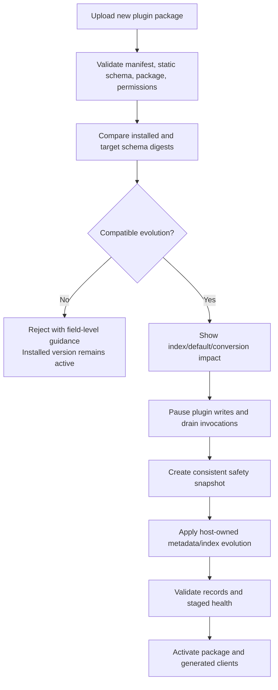

# Launch++ plugin storage and schema evolution

Status: proposed public authoring and host storage contract. No storage SDK, schema compiler, or generated client exists yet.

This document owns the data experience for Launch++ plugins. It extends the [plugin system design](./plugin-system-design.md) and uses the host persistence rules in [data and API architecture](./data-and-api-architecture.md).

## Decision

Plugin authors define typed data collections in `data/schema.ts`. Launch++ generates a framework-neutral client, optional React hooks, the static installation schema, and a safe update plan. Authors never write SQL, create database tables, maintain migration files, choose a database driver, or receive the Launch++ database connection.

Schema updates follow an intentionally limited compatibility model:

- Safe additive changes are applied automatically.
- Defaults are resolved lazily where possible.
- Fields are deprecated rather than silently deleted.
- Common conversions use a small host-owned declarative catalog.
- Changes that could lose or ambiguously reinterpret data are rejected with a repair recommendation.

Arbitrary transformation logic is logically a migration even when given another name. Launch++ does not hide that risk behind generated SQL. The supported plugin workflow instead makes common evolution automatic and makes unsafe evolution explicit and unavailable.

## Goals

- Feel familiar to React/TypeScript and vanilla TypeScript developers.
- Provide autocomplete and generated types from one schema.
- Require no SQL or database administration knowledge.
- Preserve organization and project isolation automatically.
- Keep plugin packages portable between SQLite and future host storage adapters.
- Make backup, export, disable, uninstall, and parent deletion consistent.
- Prevent one plugin from reading or damaging another plugin or the core database.
- Make compatibility understandable before an update is uploaded or activated.

## Non-goals

- Running Prisma, Drizzle, Sequelize, or another arbitrary ORM inside a plugin.
- Giving plugins raw SQL, connection strings, database files, or ORM clients.
- Supporting arbitrary table definitions, triggers, stored procedures, or database extensions.
- Automatically guessing how to perform a destructive or ambiguous conversion.
- Providing a universal no-code relational database in v1.
- Allowing themes to create records. Themes remain data-free visual declarations.

## Source project layout

```text
sprint-planner/
├── launchpp.plugin.json
├── data/
│   └── schema.ts
├── src/
│   ├── actions/
│   │   └── createSprint.ts
│   ├── pages/
│   │   └── SprintsPage.tsx
│   └── generated/
│       └── data.ts
├── .launchpp/
│   └── released-schema.json
├── tests/
├── package.json
└── tsconfig.json
```

`data/schema.ts` is author-owned. `src/generated/data.ts` and `.launchpp/released-schema.json` are CLI-owned and carry headers saying not to edit them. The released snapshot represents the last release baseline used for local compatibility feedback; installation remains authoritative by comparing the actually installed and uploaded static schemas.

The root manifest explicitly identifies the source schema:

```json
{
  "$schema": "https://launchpp.dev/schemas/plugin-v1.json",
  "id": "acme.sprint-planner",
  "name": "Sprint Planner",
  "version": "1.1.0",
  "apiVersion": "1",
  "data": {
    "schema": "./data/schema.ts"
  }
}
```

The TypeScript file is an authoring input, not an installation contract. The CLI evaluates it only in the author's development/build environment and emits a normalized declarative JSON schema. A Launch++ server never evaluates uploaded schema TypeScript or installs its dependencies.

## Schema authoring API

The schema API should resemble a small typed ORM while describing only host-supported capabilities:

```ts
import {
  collection,
  date,
  enumeration,
  index,
  relation,
  string,
} from "@launchpp/data";

export const sprints = collection(
  "sprints",
  {
    name: string().min(1).max(100),
    status: enumeration([
      "planned",
      "active",
      "completed",
    ]).default("planned"),
    startsOn: date().nullable(),
    endsOn: date().nullable(),
    goal: string().max(500).nullable(),
  },
  {
    scope: "projectScoped",
    indexes: (sprint) => [
      index("by_status").on(sprint.status),
      index("by_start_date").on(sprint.startsOn),
    ],
  },
);

export const sprintTasks = collection(
  "sprintTasks",
  {
    sprintId: relation(sprints),
    taskId: relation("launchpp.tasks"),
  },
  {
    scope: "projectScoped",
    indexes: (entry) => [
      index("by_sprint").on(entry.sprintId),
      index("unique_sprint_task")
        .unique()
        .on(entry.sprintId, entry.taskId),
    ],
  },
);
```

The first supported field vocabulary should remain small:

- String with length and supported normalization constraints
- Number with integer/range options
- Boolean
- ISO date
- UTC timestamp
- Enumeration
- Opaque host entity reference
- Relation to another collection in the same plugin
- Bounded arrays of supported scalar values where query semantics are defined

Arbitrary nested objects, recursive schemas, binary blobs, unbounded arrays, and user-defined validators are excluded initially. Files use the host asset capability and store an asset reference rather than bytes in a plugin record.

## Stable identity

The string passed to `collection()` and each field key become persistent IDs after release. Visible labels and TypeScript export names are not storage identity.

```ts
export const estimates = collection("taskEstimates", {
  storyPoints: number({
    label: "Complexity",
  }),
});
```

The author may rename `estimates` or change `"Complexity"` to `"Estimate"`. The collection ID `taskEstimates` and field ID `storyPoints` remain stable. The CLI warns when an author appears to remove and recreate an ID rather than change display metadata.

IDs are namespaced by plugin identity. `acme.sprint-planner/sprints` cannot collide with another publisher's `sprints` collection.

## Generated developer API

After schema generation, server handlers receive typed collection capabilities:

```ts
export async function createSprint(
  launch: CreateSprintContext,
  input: CreateSprintInput,
) {
  return launch.data.sprints.create({
    data: {
      name: input.name,
      status: "planned",
      startsOn: input.startsOn,
      endsOn: input.endsOn,
      goal: null,
    },
  });
}
```

Queries use a bounded host vocabulary rather than arbitrary SQL:

```ts
const activeSprints = await launch.data.sprints.findMany({
  where: {
    status: { equals: "active" },
    startsOn: { lessThanOrEqual: launch.clock.today() },
  },
  orderBy: [
    { startsOn: "desc" },
    { id: "asc" },
  ],
  limit: 20,
  cursor,
});
```

Generated methods and operators depend on field type and declared indexes. Every query is scoped automatically to the invoking plugin, organization, enabled project/parent context, actor permissions, and platform limits. The plugin cannot override injected scope fields.

Records returned to plugin code include host metadata:

```ts
type SprintRecord = {
  id: string;
  data: {
    name: string;
    status: "planned" | "active" | "completed";
    startsOn: string | null;
    endsOn: string | null;
    goal: string | null;
  };
  revision: number;
  createdAt: string;
  updatedAt: string;
};
```

Organization ID, plugin ID, owner, and authoritative parent relations are host metadata. They may be visible when useful but cannot be supplied or changed as ordinary plugin record fields.

## Browser data access

Custom React surfaces may use generated hooks built on the framework-neutral plugin SDK:

```tsx
import { useSprints } from "../generated/data";

export default function SprintsPage() {
  const sprints = useSprints({
    where: {
      status: { equals: "active" },
    },
  });

  return <SprintList sprints={sprints.data?.items ?? []} />;
}
```

Vanilla plugins use the same generated typed client through `@launchpp/sdk`; React hooks are convenience bindings, not the storage contract. The browser does not contain an ORM or database connection. Clients communicate through the authenticated sandbox bridge and capability broker. Reads are filtered by the current user's access.

Important mutations go through plugin actions/server handlers so invariants, atomic batches, permissions, idempotency, and audit behavior live in one place. The SDK may provide direct generated mutations for simple records only when their authorization and validation are entirely described by the schema.

## Storage categories

| Need | Public mechanism | Example |
| --- | --- | --- |
| Extend an existing core task/project | Native custom field contribution | Story points |
| Store plugin-owned shared records | Typed collection | Sprints, time entries |
| Store user/project/organization configuration | Typed plugin settings | Default sprint duration |
| Store external credential | Secret reference | GitHub access token |
| Store a file | Host asset reference | Invoice PDF |
| Share data with another plugin | Public command/event | Add a task to a sprint |

Settings are not a substitute for collections. Secrets never appear in settings JSON or browser hooks. Another plugin cannot query a collection directly.

## Scope and access models

Every collection declares one host-enforced access model:

- `organizationShared` — visible according to organization permission.
- `projectScoped` — linked to one project and unavailable where the plugin is disabled.
- `parentScoped` — linked to a supported core entity such as a task.
- `actorOwned` — owned by the current actor, optionally linked to a project/task.

Example:

```ts
export const timeEntries = collection(
  "timeEntries",
  {
    taskId: relation("launchpp.tasks"),
    startedAt: timestamp(),
    endedAt: timestamp().nullable(),
  },
  {
    scope: "actorOwned",
    parent: "taskId",
  },
);
```

The host assigns organization, plugin, actor, and authoritative parent scope. A user ID supplied inside plugin data never changes ownership or impersonates another actor.

## Physical host model

The public collection API does not commit Launch++ to one physical layout. A reasonable SQLite v1 implementation uses:

```text
plugin_collection_definitions
plugin_records
plugin_record_index_values
plugin_field_definitions
plugin_field_values
```

`plugin_records` logically contains:

```text
id
organization_id
plugin_id
collection_id
project_id / parent_type / parent_id / owner_actor_id
validated_data_json
revision
created_at
updated_at
archived_at / deleted_at
```

Declared searchable/sortable values are normalized into host-owned typed index storage or another measured representation. Plugins do not know the table names and cannot depend on JSON query implementation. The host may later move a hot collection to another physical strategy without changing the SDK.

## Automatic schema evolution

### Schema fingerprint

The compiled schema has a canonical representation and content digest. Authors do not manually increment a data-schema version. Launch++ records the schema digest installed for each organization/plugin version and compares it with the uploaded target.

The schema format itself has a platform-owned `formatVersion`; the CLI chooses it according to the selected plugin API and developers do not manage it by hand.

### Automatically compatible changes

| Change | Host behavior |
| --- | --- |
| Add optional/nullable field | Accept immediately; missing value resolves as `null` |
| Add field with static default | Accept; resolve default lazily and materialize on later write if needed |
| Change label/description | Metadata-only update |
| Add enum option | Accept |
| Widen string/number limit | Accept |
| Required → optional | Accept |
| Add collection | Register empty collection |
| Add non-unique index | Build in a bounded staged operation before activation |
| Remove unused index | Remove host index after compatibility check |
| Deprecate field/collection | Hide from new authoring paths while retaining data and export |

Lazy defaults prevent an update from rewriting every record solely to add a value:

```ts
priority: enumeration(["low", "normal", "high"])
  .default("normal")
```

An older record without `priority` reads as `"normal"`. When it is next changed, the host may materialize the resolved value. Queries and indexes must treat the default consistently whether or not it is materialized.

### Rejected changes

The platform rejects changes it cannot prove safe:

- Removing a field or collection containing data
- Changing a field type under the same ID
- Adding a required field without a default
- Narrowing limits when existing values may violate them
- Removing an enum value still in use
- Changing collection scope, ownership, parent, or relation target
- Adding uniqueness when existing data has duplicates
- Reusing a retired ID with new meaning
- Changing default semantics in a way that reinterprets stored absence

Example diagnostic:

```text
PLUGIN_DATA_INCOMPATIBLE

sprints.storyPoints changed from string to number.
17 of 248 stored values are not valid numbers.

Recommended:
1. Keep storyPoints as a deprecated field.
2. Add a new nullable numeric field named estimate.
3. Optionally copy valid values with the built-in stringToNumber conversion.
```

The update is not activated. The installed package and data remain unchanged.

### Deprecation instead of deletion

```ts
export const estimates = collection("taskEstimates", {
  storyPoints: string().deprecated({
    message: "Use estimate instead",
  }),
  estimate: number().nullable(),
});
```

Deprecated data remains readable to compatible code, available to administrators, and included in exports. It is excluded from new generated forms by default. Permanent purge is a separate administrator-approved lifecycle action with impact preview and retention policy; publishing a new package cannot silently purge it.

### Built-in declarative conversions

The first release can omit conversions entirely and rely on new-field/deprecation. When evidence justifies them, Launch++ may offer a small reviewed catalog:

- String to number with explicit invalid-value behavior
- Number to string
- Single selection to multiple selection
- Timestamp to calendar date with an explicit time-zone policy
- Enum value map
- Field copy or stable-ID rename
- Static default/backfill

Example authoring syntax:

```ts
estimate: number()
  .nullable()
  .copyFrom("storyPoints", {
    using: "stringToNumber",
    onInvalid: "leaveNull",
  })
```

This is a declarative host operation, not arbitrary plugin code. Before activation, the host scans affected records and reports counts, invalid examples with sensitive values redacted, time/space estimates, and the exact retention of the source field. No conversion deletes the source automatically.

## Update flow



The schema lock covers plugin records, native field values, settings, jobs, and broker writes for the affected organization/plugin. Network effects and executable plugin handlers do not run during evolution. Core work and unrelated plugins remain available.

If preparation or validation fails before activation, discard staged metadata/indexes and keep the previous package active. Because supported changes are non-destructive, the old package remains able to read its existing data. A failed post-activation health check pauses the plugin and exposes diagnostics; rollback is allowed only after compatibility is rechecked.

## Concurrency and atomicity

Records carry revisions. Updates and deletes provide `expectedRevision`; conflicts are typed rather than last-write-wins.

```ts
await launch.data.sprints.update({
  id: sprint.id,
  expectedRevision: sprint.revision,
  data: {
    status: "completed",
  },
});
```

Plugins may submit bounded atomic operation batches over their records plus approved core mutations. The host validates the entire batch and commits it with an idempotency record. Arbitrary plugin code and network calls never run inside the database transaction.

Unique indexes are host-enforced. Race-sensitive invariants such as one active timer per actor use a declared unique key rather than a read-then-insert check in plugin code.

## Relations and lifecycle

- Relations to core entities use supported opaque references and host authorization.
- Cross-organization references are rejected.
- Plugin-to-plugin storage relations are prohibited; use public commands/events.
- Task-owned records follow a task moving within its organization according to declared policy.
- Archive makes linked records read-only or hidden according to parent semantics.
- Recoverable deletion hides linked records and restoring the parent restores them.
- Permanent parent purge cascades host-linked records after retention.
- Disabling a plugin stops writes/execution and hides contributions while retaining data.
- Uninstall retains data by default; purge is explicit and separately confirmed.

## Export and portability

Organization export contains:

- Compiled plugin schema and digest
- Collection/field definitions
- Plugin records and revisions
- Parent/owner relations represented through portable IDs
- Settings excluding secrets
- Installed package identity/version/digest and enabled scopes

Import validates data against the included schema without executing the plugin package. If the package is absent or incompatible, data remains dormant and administratively exportable. Installing the compatible package later reactivates it after normal review.

Because plugins use the host storage contract instead of SQLite-specific SQL, the same package can run against a future supported persistence adapter.

## Limits and quotas

The platform publishes measured defaults and safe configurable ranges for:

- Collections per plugin
- Fields and indexes per collection
- Record and string size
- Array length
- Query page size, filters, sort keys, and execution time
- Records scanned during compatibility analysis
- Concurrent queries and mutations per invocation
- Total storage per organization/plugin according to host policy
- Index-build disk and time budget

The CLI catches static limit violations. The server remains authoritative because package contents, installed data volume, and operator policy can differ from the author's environment.

## Author diagnostics

`launchpp check` and `launchpp data check` report the schema in product language:

```text
Data schema: compatible

Collections
  sprints       5 fields · 2 indexes · project scoped
  sprintTasks   2 fields · 2 indexes · project scoped

Changes since 1.0.0
  + sprints.goal             optional string
  + sprints.status.cancelled enum option

Existing data deleted       no
Manual migration required   no
```

An incompatible change reports the field, reason, existing-data evidence when a development host is connected, and one or more safe remedies. It does not display generated SQL.

## Advanced external data

A plugin that already has a complex Prisma/PostgreSQL service may connect to that separately operated service through declared brokered HTTPS capabilities. Its remote database remains the publisher/operator's responsibility. The Launch++ plugin package still does not connect directly to the Launch++ database or receive arbitrary local database credentials.

This mode must disclose data leaving the installation, handle credentials through the vault, work through destination allowlists, and define degraded behavior when the external service is unavailable.

## Acceptance criteria

- [ ] A React or vanilla TypeScript developer defines and queries a collection without SQL or database configuration.
- [ ] The server installation artifact contains static schema JSON, not executable schema TypeScript.
- [ ] Generated server clients, browser clients, and optional React hooks agree with the compiled schema.
- [ ] Organization, plugin, project/parent, and actor scope cannot be forged through record data.
- [ ] Adding an optional/defaulted field requires no record rewrite or author migration.
- [ ] Display-label changes do not change storage identity.
- [ ] Destructive or ambiguous changes are rejected before the installed package/data changes.
- [ ] Deprecated data remains exportable and cannot be silently purged by an update.
- [ ] Unique and revision constraints remain correct under concurrent requests and retries.
- [ ] Disable, uninstall, parent deletion, export, and import follow documented lifecycle rules.
- [ ] A packaged external plugin uses no ORM driver, connection string, SQL, or internal database import.

## Decisions captured

- Plugin projects have a first-class `data/schema.ts` authoring surface.
- `@launchpp/data` is a constrained schema DSL with ORM-like ergonomics, not a database ORM.
- Launch++ generates typed clients, optional framework bindings such as React hooks, and the static installation schema.
- The platform owns physical storage, indexes, authorization, transactions, backups, and portability.
- Plugin developers never write SQL or migration files.
- Authors do not manually manage plugin data-schema version numbers; canonical schema digests identify installed state.
- Safe evolution is automatic; unsafe changes are blocked.
- Deprecation and additive replacement are preferred to deletion or in-place type changes.
- Optional built-in conversions are declarative, previewed, non-destructive, and host-executed.
- Arbitrary ORM/database access is outside the standard plugin model.
