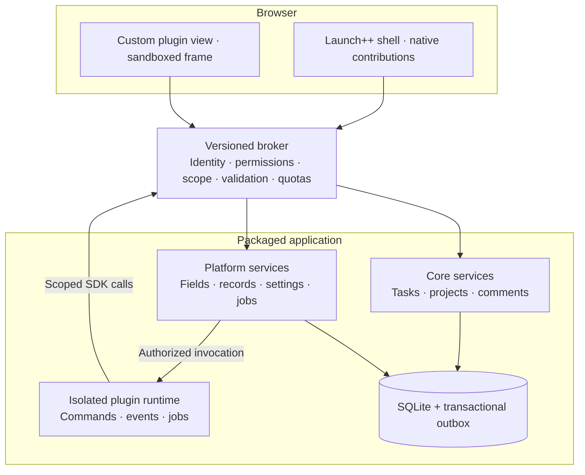

# Launch++ plugin platform and developer experience

Status: architecture proposal for review. No application code or SDK has been implemented.

This subsystem design is part of the [Launch++ architecture documentation](./README.md). The [system architecture](./system-architecture.md) defines the host runtime and module boundaries; this document owns the public plugin model and lifecycle. The [plugin storage design](./plugin-storage-design.md) and [plugin CLI design](./plugin-cli-design.md) own those authoring contracts in detail.

Launch++ should make a useful plugin feel like a small feature contribution: declare what it adds, write only its unique behavior, and let the platform handle persistence, permissions, rendering, packaging, and operations. Use Figma as the reference for approachable authoring, contextual actions and optional custom UI, adapted to persistent team workflows and server-side execution.

Imagine enabling Story Points for one project. A number field appears in task details; it becomes available as a list column, board-card property, filter, and sort key. It follows the current theme and exports with the organization. The author writes one manifest contribution. No database migration, API route, custom input component, or change to Launch++ is required.

This is a proposed architecture and developer contract, not an implemented SDK. The repository currently contains only a basic package.json; every path, package name, command, and API below is proposed. The design focuses on the extension platform and its UX contracts, not final visual styling.

The first author preview is complete when a developer can generate either a React/TypeScript or vanilla HTML/CSS/JavaScript plugin, add a project page through `launchpp.plugin.json`, read fixture project and task data through the public SDK, hot reload, pack and install it without application-internal imports. React is the recommended and best-supported authoring path, while the runtime contract remains framework-neutral. A Story Points example then validates native field contributions and portable storage. The first supported SDK release adds a Checklist Importer, Time Tracking and a read-only Due-date Calendar. These deliberately test different capabilities; they are reference plugins, not mandatory core features.

### Inspiration from Figma

Figma provides a small authoring model: a manifest, a JavaScript entry point, an optional custom UI and a recognizable product API. Its development workflow includes starter files, TypeScript support and hot reload. Launch++ should offer that same clarity through a generated local project and an immediate browser preview. Its development loop must work with the web-based local installation without requiring a desktop client. [Figma manifest](https://developers.figma.com/docs/plugins/manifest/), [Figma quickstart](https://developers.figma.com/docs/plugins/plugin-quickstart-guide/)

Figma's parameters let plugins collect input without building custom UI. Adopt that idea for Launch++ actions: authors declare inputs and write a handler; the host supplies forms, command-palette prompts, validation and result feedback. React should be optional for a useful first plugin. [Figma parameters](https://developers.figma.com/docs/plugins/plugin-parameters/)

Figma separates document-access logic from iframe UI and connects them through messages. Borrow the explicit API boundary and provide a typed bridge that hides routine messaging. In Launch++, shared-data access and mutations are authorized by the server, and durable background handlers run there even when no browser is open. The local installation runs that same server on the user's laptop. [How Figma plugins run](https://developers.figma.com/docs/plugins/how-plugins-run/)

Figma also distinguishes plugins run by an individual from shared widgets in a file. Launch++ needs contextual actions and persistent shared features, with background execution as an additional capability. These belong to one package format and one SDK; the product does not require authors to choose separate plugin and widget ecosystems. [Figma plugins versus widgets](https://developers.figma.com/docs/widgets/widgets-vs-plugins/)

### The architectural commitment

Build a modular application with a small domain core and a first-class extension platform. Keep organizations, identity, authorization, projects, tasks, comments, and activity in the core. Put plugin lifecycle, extension registration, typed storage, event delivery, and the UI shell in platform modules.

The core product remains usable with all optional plugins disabled. Official optional features use the same public contracts as external plugins. List and Board can reuse the view registry and query primitives without making essential navigation removable.

Use TypeScript for the application and SDK, React for the application and first-party plugin UI kit, and a Node.js backend as the proposed implementation direction. Keep the plugin browser contract at HTML, CSS, JavaScript, versioned JSON messages and schemas so React internals, the ORM, and server framework never become plugin APIs. Do not introduce microservices or a mandatory external queue. SQLite and a database-backed jobs/outbox module are the initial deployment baseline.

A CLI and generated code should hide packaging and RPC details. They cannot hide missing platform capabilities: if an official reference plugin requires a private import, extend the public API or reduce that plugin’s scope before releasing it.



Native declarations use host rendering. Executable extensions reach data through scoped broker calls. Runtime process boundaries remain subject to the isolation prototype. The same application package runs locally or on a VPS.

### One package, progressive complexity

A plugin has one identity and one root manifest, with optional server handlers and browser bundles. Authors start with declarations and add code as the feature grows. These are capabilities of one plugin format, not three separate plugin systems.

| Capability | User experience | Lifecycle and execution | Examples |
| --- | --- | --- | --- |
| Actions | Run a command from the palette, a task menu or a button | Bounded invocation under the initiating user's permissions; optional input form and preview | Create tasks from a checklist, bulk label selected tasks |
| Features | Enable a lasting addition to a project or organization | Contributions stay registered while enabled; UI loads when needed and data is host-persisted | Story Points, Calendar, Time Tracking |
| Background behavior | Configure a reaction or schedule | Durable server invocations under a separately granted plugin identity | Process reminders, synchronize issues |

These capabilities can be combined. Time Tracking can add a Start timer action, a Timesheets view and scheduled processing in one package. A persistent feature does not imply a continuously running JavaScript process: declarations remain registered, state is stored by the host, and handlers activate only when needed.

Declarative contributions describe fields, settings forms, standard views, action inputs, placements and theme tokens. Server handlers implement commands, post-commit reactions and scheduled work. Custom browser UI is optional for richer panels, views or action dialogs. Authors start with the smallest combination their feature requires.

Registration is static. The application can explain a plugin’s UI, requested access, and compatibility before executing it. Build tooling emits a validated JSON manifest and bundled assets. Installation never executes package install scripts or evaluates an author’s TypeScript definition.

| Extension point | What authors declare or implement | Delivery |
| --- | --- | --- |
| Task/project fields | Typed value, label, constraints, visibility and allowed placements | Author preview starts with task number/text fields; expand in supported SDK |
| Settings | Organization/project/user scope; typed schema; host-rendered form | Supported SDK; only enablement controls in author preview |
| Actions / commands | Typed inputs and results, generated input UI, handler, optional preview, task menu or command-palette placement | Behavior milestone starts with Checklist Importer |
| Task panels and project views | Standard host-rendered layout or custom sandboxed UI | Custom-view milestone |
| Plugin records | Private typed collections with declared indexes and parent scope | Behavior milestone; native field storage in author preview |
| Events and jobs | Post-commit subscriptions, retry-safe handlers, scheduled work | Supported SDK after command and collection contracts |
| Themes | Validated semantic tokens, light/dark variants; no executable code | Built-in tokens in author preview; theme packages in supported SDK |
| External integrations | Brokered HTTP, credential references and webhook endpoints | After reference plugins |
| Reusable automation rules / custom domain entities | Build on commands, events and private collections after real use | Later; no generic entity framework in v1 |

### Browser-standard runtime, React and vanilla authoring

A Launch++ plugin should feel like a normal React project or a small vanilla browser project. The host contract is deliberately smaller: custom surfaces compile to HTML, CSS and JavaScript and communicate through the Launch++ bridge. The host does not execute React source or require React to install a plugin. React with TypeScript is the recommended component authoring experience; vanilla HTML/CSS/JavaScript or TypeScript is also supported in v1. Vue, Svelte and Angular authoring adapters and SDK bindings are outside the planned v1 scope.

The root `launchpp.plugin.json` file is the authoritative source contract for identity, compatibility, permissions, source entry points and placements. Launch++ tooling can inspect it before running plugin code. A published JSON Schema supplies editor completion and validation. The following is the recommended React template:

```text
sprint-planner/
├── launchpp.plugin.json
├── data/
│   └── schema.ts
├── src/
│   ├── pages/SprintsPage.tsx
│   ├── panels/TaskSprintPanel.tsx
│   ├── settings/SettingsPage.tsx
│   ├── actions/addToSprint.ts
│   ├── generated/data.ts
│   └── styles.css
├── .launchpp/released-schema.json
├── tests/
├── package.json
└── tsconfig.json
```

The CLI generates build configuration and package scripts. Directories, filenames and component names are conventions for readability; the manifest is the registration contract. A React entry may default-export a component, while a vanilla entry may be an HTML document or JavaScript/TypeScript module selected by its adapter. Server modules expose the handler named by the manifest. Naming patterns can improve scaffolding and discovery, but must never be the only registration mechanism.

```json
{
  "$schema": "https://launchpp.dev/schemas/plugin-v1.json",
  "id": "acme.sprint-planner",
  "name": "Sprint Planner",
  "version": "1.0.0",
  "apiVersion": "1",
  "authoring": {
    "adapter": "react-vite"
  },
  "permissions": [
    "projects:read",
    "tasks:read",
    "tasks:write"
  ],
  "data": {
    "schema": "./data/schema.ts"
  },
  "contributes": {
    "pages": [
      {
        "id": "sprints",
        "scope": "project",
        "path": "sprints",
        "title": "Sprints",
        "entry": "./src/pages/SprintsPage.tsx",
        "navigation": {
          "slot": "project.navigation",
          "label": "Sprints",
          "icon": "cycles"
        }
      }
    ],
    "panels": [
      {
        "id": "task-sprint",
        "slot": "task.details.panels",
        "title": "Sprint",
        "entry": "./src/panels/TaskSprintPanel.tsx"
      }
    ],
    "actions": [
      {
        "id": "add-to-sprint",
        "slot": "task.actions",
        "title": "Add to sprint",
        "handler": "./src/actions/addToSprint.ts#addToSprint"
      }
    ],
    "settings": [
      {
        "id": "settings",
        "scope": "organization",
        "title": "Sprint Planner",
        "entry": "./src/settings/SettingsPage.tsx"
      }
    ]
  }
}
```

The `authoring.adapter` field selects the local build adapter and is removed from the installed contract. V1 recognizes only `react-vite`, `vanilla-typescript-vite` and `vanilla-javascript-vite`. Build tooling resolves and bundles `.tsx`, `.html`, `.ts`, `.js`, CSS and local asset entries into normalized browser surfaces and a generated distribution manifest. The host sees only an HTML document and its local assets:

```json
{
  "id": "acme.sprint-planner",
  "version": "1.0.0",
  "apiVersion": "1",
  "browser": {
    "surfaces": {
      "sprints": {
        "document": "./browser/surfaces/sprints/index.html"
      }
    }
  },
  "contributes": {
    "pages": [
      {
        "id": "sprints",
        "scope": "project",
        "path": "sprints",
        "title": "Sprints",
        "surface": "sprints"
      }
    ]
  }
}
```

This generated `manifest.json` is the distribution contract. It is not an additional file the author maintains. Tooling also compiles `data/schema.ts` into a static declarative schema and generates typed data clients during author development. Installation never evaluates source configuration or schema TypeScript, runs package scripts, installs dependencies, or requires a compiler on the user's server.

The SDK is layered so vanilla code does not depend on React:

- `@launchpp/sdk` provides framework-neutral transport, context, tasks, data, commands, events, navigation, themes and structured errors.
- `@launchpp/sdk/react` provides hooks and React lifecycle integration.
- `@launchpp/ui` is the React component library powered by Ant Design and configured for Launch++.
- `@launchpp/ui-tokens` exposes browser-standard CSS variables, icons and foundational styles for custom React and vanilla UI.

React is the default for custom pages, panels, dialogs and settings experiences. Authors can import the broad Ant Design-backed catalogue and Launch++ product components from `@launchpp/ui`, or use ordinary React, browser-compatible packages and scoped CSS. The official library applies Launch++ typography, density, focus behavior, responsive patterns, motion and themes. Vanilla and custom React components receive semantic CSS variables such as `--launch-color-surface`, `--launch-color-text-primary` and `--launch-color-border`. Ant class names, DOM structure and internal tokens are not public contracts. The full UI policy is defined in [Plugin UI system](./plugin-ui-system.md).

```tsx
import { Button, EmptyState, Stack, Text } from "@launchpp/ui";
import { useCurrentProject, usePluginQuery } from "@launchpp/sdk/react";

export default function SprintsPage() {
  const project = useCurrentProject();
  const sprints = usePluginQuery("sprints", {
    where: { projectId: project.id },
  });

  return (
    <Stack gap="lg">
      <Text as="h1">Sprints</Text>
      {sprints.data.length === 0 ? (
        <EmptyState
          title="No active sprint"
          action={<Button>Create sprint</Button>}
        />
      ) : (
        <SprintList sprints={sprints.data} />
      )}
    </Stack>
  );
}
```

The same surface can be authored without React:

```html
<main class="page">
  <h1>Sprints</h1>
  <button id="create-sprint">Create sprint</button>
</main>
<script type="module" src="./main.js"></script>
```

```ts
import { createClient } from "@launchpp/sdk";

const launch = await createClient();
document.querySelector("#create-sprint")?.addEventListener("click", async () => {
  await launch.commands.invoke("createSprint", {
    projectId: launch.context.projectId,
  });
});
```

The developer may replace every visible component in a custom surface with their own components and CSS. Plugin styles remain scoped and cannot change the Launch++ shell. Custom UI runs in an isolated browser surface; the SDK hides message correlation, serialization, cancellation and structured errors.

Small shell controls remain host-rendered. A navigation item, task-menu action, board-card badge or command-palette item is declared in JSON, and Launch++ renders the actual control. Selecting it invokes a handler or opens a custom browser surface. This prevents one iframe per button or task card while keeping the surrounding UI consistent. Rich surfaces such as pages, panels, dialogs and settings pages use React or vanilla browser code in v1.

The proposed creation workflow is detailed in the [plugin CLI design](./plugin-cli-design.md):

1. `pnpm create launchpp-plugin` asks for React/TypeScript or vanilla browser authoring and whether the plugin starts with a page, task panel, action, data collection, settings page or background integration.
2. `pnpm dev` opens a disposable local Launch++ organization with hot reload, fixtures, scoped logs, data inspection and a plugin inspector.
3. `pnpm check` validates the manifest, permissions, entry points, unsupported imports, data compatibility, schemas and contribution collisions.
4. `pnpm test` runs against the same broker and runtime contracts used by Launch++.
5. `pnpm pack` creates a `.launch-plugin` archive containing the generated manifest, static data schema, browser and server bundles, contract schemas, integrity hashes and license metadata. It contains no SQL or plugin-authored migration files.

These are target commands, not commands available today. Plugin users install the resulting archive without a compiler or JavaScript toolchain.

The `.launch-plugin` file is a deterministic, ZIP-compatible archive, but it is not an arbitrary framework `dist/` folder. `launchpp pack` invokes the selected build adapter on the author's machine and normalizes its output into the exact portable shape Launch++ installs:

```text
manifest.json
browser/
├── surfaces/
│   ├── sprints/index.html
│   └── task-panel/index.html
└── assets/*.{js,css,svg,png}
server/handlers.js                 # optional
data/schema.json                   # optional
schemas/commands/*.json            # optional
schemas/events/*.json              # optional
assets/*                            # optional package metadata assets
integrity.json
license.txt
```

The exact optional files depend on declared capabilities. All browser documents and their referenced assets must remain inside the archive. Installation validates paths, sizes, manifest shape, compatibility and hashes, then stores the package immutably. It never runs npm, pnpm, a framework build, TypeScript, install scripts or plugin source code.

The Phase 0 implementation fixes the deterministic ZIP, SHA-256 integrity, traversal/resource-limit, and atomic content-addressed staging behavior described in [Plugin packaging and intake proof](./plugin-package-proof.md). The author-facing CLI and upload review UI build on that single intake boundary later.

### Developer Mode and the live development channel

The pack-and-upload loop is for release validation, not every edit. Launch++ includes an operator-controlled **Settings → Developer → Developer Mode** switch and the CLI supports two development paths:

- `launchpp dev` starts a disposable local Launch++ organization with fixtures. This is the safest and default path.
- `launchpp dev --connect https://launch.example` pairs the local CLI with an existing Launch++ installation for an authenticated preview.

Connected development uses a short-lived, one-time pairing code confirmed in the browser. The CLI opens an outbound authenticated TLS/WebSocket channel and streams compiled incremental artifacts—not source files—to the host. A remote VPS never reaches into the developer's localhost or filesystem. The host registers an ephemeral identity such as `dev:<session-id>:<plugin-id>`; it does not replace or mutate the installed release.

A development plugin is visible only to its author by default and runs in a dedicated development organization rather than production data. Access for selected test users can be added later. Requested permissions still require explicit approval, permission changes prompt again, and the same iframe sandbox, capability broker, runtime limits, network policy and data boundaries apply. Developer Mode enables a temporary unsigned live-build channel; it does not disable security.

Browser changes use framework HMR when the adapter supports it and otherwise reload the affected iframe. Manifest changes re-register ephemeral contributions. Server changes replace the next isolated invocation. Compatible schema changes evolve ephemeral development storage; incompatible changes stop with guidance or offer a reset only for disposable data. Diagnostics appear in the CLI, a surface error overlay and the plugin inspector.

Disconnecting, expiry or disabling Developer Mode revokes the session token, removes ephemeral contributions and assets, stops development handlers, and applies the selected disposable-data retention policy. A release still passes `check`, `test` and `pack`; connected preview is never a substitute for testing the deterministic archive.

Server handlers receive an invocation-scoped, typed `launch` capability object. Namespaces such as `launch.tasks`, `launch.projects`, `launch.store` and `launch.context` expose only granted operations. Context contains host-validated organization, project, user and selected-entity references. Selection is useful context rather than an authorization grant; every operation rechecks access.

```ts
export async function addToSprint(
  launch: AddToSprintContext,
  input: AddToSprintInput,
) {
  return launch.store.sprintTasks.insert({
    sprintId: input.sprintId,
    taskId: launch.context.taskId,
  });
}
```

The plugin inspector shows registered contributions, effective grants, current scope, action inputs and results, event deliveries and exact failures with source locations. Development uses production isolation rules so a plugin that works locally remains portable.

### A clean interface as plugins accumulate

The product should make the three capabilities feel concrete:

- **Checklist Importer:** Open the command palette → choose Create tasks from checklist → paste text → review the proposed tasks → confirm. The plugin supplies parsing and execution; the host supplies the interaction surface.
- **Story Points:** Enable it for a project → make its field visible where useful → edit points through ordinary task controls. Teammates see the project's enabled feature without installing separate personal copies.
- **Time Tracking:** Use Start timer on a task → inspect the running state → open Timesheets when needed. Store start/stop timestamps; closing a browser does not lose the timer or require a continuously executing browser script.

Action input schemas describe labels, types, required fields, constraints and defaults. Render a native form or command-palette prompt from the same schema. Start with static choices; introduce authorized, read-only suggestion providers when needed. Show validation, progress, cancellation and errors consistently. Keep a simple action inline; open a custom dialog only when its interaction requires one.

A preview is an explicit optional read-only preparation handler returning a host-supported summary; the platform cannot infer arbitrary plugin effects from an input schema. Checklist Importer uses this path to show the tasks it intends to create. Bind confirmation to the reviewed input and relevant revisions, and revalidate permissions at execution. A changed input requires a fresh preview. Cancelling before execution performs no mutation; cancelling after a committed mutation does not imply rollback. Results must say what completed.

Slots are named, versioned product surfaces. The initial vocabulary should include `organization.navigation`, `project.navigation`, `project.toolbar`, `task.actions`, `task.details.fields`, `task.details.panels`, `task.card.badges`, `task.card.actions`, `board.toolbar`, `board.card.actions`, `board.sidebar`, `settings.organization`, `settings.project`, `settings.user` and `commandPalette`. Each slot documents its supported contribution type, context, lifecycle and space constraints.

Plugins request a slot through the manifest; the host controls surrounding layout, ordering, responsive behavior and overflow. Namespaced contribution IDs prevent collisions, and the registry rejects duplicate IDs inside a package. Plugin identity remains visible in management and diagnostics. Slots are stable public API; internal React component paths are not.

A task field automatically becomes available in the native column picker, filter controls and export. Enabling a plugin does not automatically put every field on every card. Organization administrators choose which fields/views each project exposes; individual users can retain view preferences.

Use native rendering for small contributions, including fields, settings and common lists. Reserve custom UI for substantial panels and views. Avoid one iframe per table cell. The Ant Design-powered React UI kit supplies controls, task links, loading/empty/error states, typography and spacing; `@launchpp/ui-tokens` supplies the browser-standard visual contract for custom React and vanilla surfaces. The wire protocol stays independent of React.

Custom views live within the application’s navigation and route model, with deep links and scoped URLs owned by the host. The host mediates dialogs, toasts, navigation and permission prompts. Plugin CSS cannot modify the shell. Theme packages set validated semantic tokens; custom plugins receive the resolved tokens.

Organization administrators enable plugins; project-scoped plugins are then enabled only in chosen projects. Server operators control which executable packages are allowed on their installation. A locally running solo owner sees these as one simple flow. Installation shows what will be added, what access is requested, and any connection setup. A plugin with no required settings can be enabled in one action.

Errors remain local to the affected plugin surface. Repeated failures pause its handlers and show an actionable status in Settings → Extensions. A safe-start option loads the core with all optional plugins disabled.

### Shared state and core data access

Plugin authors should experience shared state through typed SDK clients and optional framework bindings without gaining access to Launch++'s internal React context, query cache, Redux/Zustand store, ORM or database. The public SDK owns the transport and subscription boundary so Launch++ can change its internals without breaking plugins.

| State | Example | API and owner |
| --- | --- | --- |
| Local UI state | Open dialog, selected tab, unfinished input | The plugin framework's local state inside the surface |
| Shared plugin state | Sprints, timers, plugin settings | Host-backed plugin collections through `usePluginQuery`, mutations and server handlers |
| Launch++ domain state | Tasks, projects, labels, members | Permission-filtered domain hooks such as `useTask`, `useTasks` and `useCurrentProject` |

```tsx
import {
  useCurrentProject,
  usePluginQuery,
  useTasks,
} from "@launchpp/sdk/react";

export default function SprintBoard() {
  const project = useCurrentProject();
  const tasks = useTasks({ projectId: project.id });
  const sprints = usePluginQuery("sprints", {
    where: { projectId: project.id },
  });

  return <Board tasks={tasks.data} sprints={sprints.data} />;
}
```

The bridge delivers snapshots and invalidations to subscribed surfaces. When the core application or another authorized plugin updates a task, relevant hooks refresh. Mutations go through typed SDK operations or registered server actions, then trigger the same invalidation path. A plugin never receives data the current user cannot access, and background code uses a separately granted service identity.

Plugin collections are namespaced, typed, indexed and scoped to an organization with an optional project, task or actor parent. Plugins cannot directly read another plugin's private collection. Cooperation happens through public contracts.

### Communication between plugins

A plugin may publish versioned commands and events as a public capability. A command asks the provider to perform an operation and returns a typed result. An event announces a fact after it has happened and is delivered asynchronously. The provider keeps ownership of its validation, storage and invariants.

Sprint Planner can publish a command without exposing its tables:

```json
{
  "provides": {
    "commands": [
      {
        "id": "sprints.addTask",
        "version": "1",
        "handler": "./src/actions/addTask.ts#addTask",
        "inputSchema": "./schemas/add-task.input.json",
        "outputSchema": "./schemas/sprint-task.output.json"
      }
    ],
    "events": [
      {
        "id": "sprint.completed",
        "version": "1",
        "schema": "./schemas/sprint-completed.json"
      }
    ]
  }
}
```

Another plugin invokes the namespaced command through the broker:

```ts
const result = await launch.commands.invoke(
  "acme.sprint-planner:sprints.addTask",
  { sprintId, taskId },
);
```

Its manifest declares both the package compatibility it needs and the exact public contract it consumes:

```json
{
  "dependencies": {
    "acme.sprint-planner": "^1.0.0"
  },
  "uses": {
    "acme.sprint-planner:sprints.addTask": "^1"
  }
}
```

`dependencies` controls whether the consumer can be enabled with the installed provider package. `uses` identifies and versions the public contract. Optional dependencies allow an integration to activate only when its provider is present. Contract artifacts may generate TypeScript clients containing schemas and types, but never provider implementation or storage access.

The invocation broker verifies that the provider is installed and enabled in the current scope, that the caller declared the contract, that input matches the published schema, and that the original user or background identity is authorized. The provider runs its own domain checks, and the broker validates the output before returning it. The caller receives only the declared result and does not inherit the provider's broader permissions. This prevents commands from becoming permission tunnels.

Commands express intent: add a task to a sprint, start a timer or generate an invoice. Events report facts: a sprint completed, a timer stopped or an invoice was paid. Event delivery is durable and at least once; consumers must be retry-safe. Commands that mutate state require idempotency contracts.

Plugins cannot import another plugin's source, call private handlers or query its storage. Public contracts let providers evolve their internal schema, emit the correct activity, enforce permissions and update independently. Hard plugin dependencies and inter-plugin contracts follow after the core SDK is stable; the first author preview does not depend on them.

### Execution and permissions

Use a capability broker: plugins receive narrow SDK operations, never a database connection, environment variables, filesystem access, shell access or application session cookie.

For server behavior, the feasibility prototype is QuickJS compiled to WebAssembly, inside a supervised worker with fresh invocation contexts, memory limits and execution deadlines. The spike proved the basic controls but did **not** qualify a same-process worker as the security boundary for untrusted publisher code. The accepted decision limits executable bundles to an operator-trusted preview until an OS-process supervisor passes the adversarial and async-broker gates. Expose only the SDK bridge and retain the ability to change the runtime behind that protocol. See [Server plugin runtime feasibility decision](./server-plugin-runtime-decision.md).

This is an execution architecture, not a security guarantee. Cancellation and the synchronous abuse corpus pass; async capability bridging and process-level memory containment remain required before accepting untrusted executable plugins. A worker alone is not a sufficient boundary. Node documents that worker resource limits exclude external data such as `ArrayBuffer`s and can still end in a process-wide OOM. The QuickJS wrapper supplies useful runtime controls but is pre-1.0 and unaudited. [Node worker documentation](https://nodejs.org/api/worker_threads.html), [QuickJS wrapper documentation](https://github.com/justjake/quickjs-emscripten)

The tradeoff is intentional: bundled pure JavaScript dependencies are eligible; arbitrary Node built-ins, native modules and unrestricted provider SDKs are not supported. Provide small official adapters for common integrations instead. If the runtime cannot meet the compatibility and isolation tests, keep executable plugins in a clearly marked operator-trusted preview and defer public untrusted installation; do not weaken the broker contract to ship it.

For custom browser UI, use sandboxed frames without same-origin privileges, a restrictive content policy, bundled assets and a validated message channel bound to the frame and its current scope. The host must validate every request, not trust a plugin-supplied organization ID. Remote network access and credentials go through the broker. Native sandbox behavior and its same-origin caveats are documented by [MDN](https://developer.mozilla.org/en-US/docs/Web/HTML/Reference/Elements/iframe).

Browser isolation also needs an explicit egress test: requests, images, forms, popups and frame navigation must not bypass granted destinations. Do not claim full containment merely because an iframe exists. If browser controls cannot enforce the intended policy across supported browsers, keep arbitrary third-party UI out of the trusted-data release until a stronger renderer or isolation design is proven.

Interactive calls use the intersection of plugin grants, the current user’s permissions, enabled project scope, and installation policy. Background handlers use a distinct plugin service identity limited to administrator-approved operations and enabled scopes; they do not inherit an owner’s authority. Record the original event actor separately for audit. Recheck grants when jobs run and revoke queued work when the plugin is disabled.

Network permission is an explicit destination allowlist. The broker validates redirects and resolved addresses, blocks private/link-local/metadata destinations by default, applies rate/size/time limits, and injects scoped credentials server-side. Credential references are never returned to browser UI. A grant summary explains that approved external connections can transmit the data the plugin is permitted to read.

### Data ownership and durable contracts

Core entities retain explicit domain schemas. Plugins extend them through namespaced field definitions and values; they cannot add columns to core tables. Field IDs are immutable within a plugin identity. A field rename changes its label. An in-place type change is rejected; authors add a new typed field, deprecate the old one, and may request a supported host-owned declarative conversion.

Support number, text, boolean, date and single/multiple select fields initially. Field types define validation, ordering, null behavior and supported query operators. Expose these through the ordinary task query API, with server-side filtering, sorting and cursor pagination. Indexing must be part of the implementation; fetching all tasks into a browser to filter a plugin field is not acceptable.

Plugins declare private typed collections—for example `timeEntries`—in `data/schema.ts`. The CLI compiles this author-friendly DSL into a static JSON schema and generates typed server/browser clients plus optional framework bindings such as React hooks. The host provides declared indexes, bounded queries, optimistic concurrency and atomic operation batches. Records carry organization and plugin identity automatically, plus a project/task parent or actor owner when appropriate. The API enforces parent access and rejects references across organizations. This handles plugin-specific entities without exposing SQL, an arbitrary ORM, or a universal entity builder. The complete model is in [plugin-storage-design.md](./plugin-storage-design.md).

Every collection declares its access model: organization-shared, parent-scoped, or actor-owned with an optional parent. The host enforces that declaration. For actor-owned records it assigns and checks the owner; user IDs supplied by plugin code cannot impersonate another actor. Background service access to those records requires a separate explicit grant.

Task-owned field values and records follow the task when it moves between projects in the same organization. Authorization derives the current project from the authoritative task relation; copied project IDs are never sufficient. If the destination has the plugin disabled, data remains dormant and exportable, while plugin execution and normal contribution visibility stop there. Project-owned records remain in their original project. Cross-organization moves are outside the initial contract.

Archiving preserves data and makes plugin writes to the archived parent unavailable. Recoverable deletion hides the parent and its linked plugin data from ordinary queries; restoring the parent restores that data. Permanent parent deletion cascades to linked field values and records after retention, through host-maintained relationships. Background service identities obey the same lifecycle rules. Organization-level records without a parent follow organization retention. Plugins do not receive a generic bypass to retain identifiable copies of purged parent data.

Keep public IDs as opaque strings, dates as ISO date-only values, timestamps as UTC strings, and absence as explicit null where supported. Use revision checks for conflicting updates and structured errors with stable codes. The initial wire API separates its version from package semver and the platform-owned data-schema format. Installed plugin schema state is identified by a canonical digest; authors do not manually increment a data-schema version.

Logical data groups are:

- PluginPackage: immutable identity, version, digest and manifest.
- OrganizationPlugin: enablement, accepted grants, installed schema digest and health.
- ProjectPlugin: project-specific activation and non-secret settings.
- FieldDefinition / FieldValue: namespaced typed extensions linked to core entities.
- PluginRecord: scoped collection data and revision.
- Delivery / Job: durable queue state, attempts, idempotency and causation.
- SecretReference: scoped credential metadata; secret material lives in the host vault.

These are proposed logical records, not a committed physical table design. The host owns backup/export mechanics. Application code, including plugins, uses services rather than database-specific SQL.

### Commands, events and jobs

Commands express user intent and return a typed result. They run under the initiating user’s permissions. Events report facts after a transaction commits. An event includes an immutable event ID, versioned type, organization and entity reference, revision, occurrence time, original actor, source plugin and causation chain. Only eligible subscribers receive it; payload fields are permission-filtered.

Write domain changes and their outbox entries in one database transaction. Deliver events at least once, with bounded retries and a visible failed-delivery queue. Do not promise total ordering or exactly-once external effects. Handlers must tolerate duplicates and stale revisions. Plugin commands and core mutation APIs accept idempotency keys; the platform stores those keys atomically with the corresponding local effect.

A retry-safe helper must combine the plugin’s own record changes and completion marker in a host-managed transaction. Plugins submit bounded operation batches with revision preconditions; the host validates and commits them atomically. Do not hold a database transaction open while arbitrary plugin code or network calls execute. A simple “seen event” flag written before or after side effects is insufficient. Outgoing requests need provider-supported idempotency or reconciliation; the SDK cannot make an arbitrary third-party request exactly once.

A command handler can issue several broker calls, but those calls are independently committed unless grouped in an explicit atomic batch. The SDK must make this distinction visible. Idempotency keys are scoped to installation, organization, plugin, actor and command, and bound to a hash of validated inputs; reusing a key with different inputs is rejected. The host checks completed keys before invoking a handler and again within the committing transaction. Retain completion results through the documented retry window. Multi-effect workflows need a durable workflow state or separate stable effect keys.

For Time Tracking, declare actor-owned `activeTimers` and `timeEntries` collections linked to tasks. A host-enforced unique index on the owner in `activeTimers` permits one active timer per user per organization for this plugin. Starting creates the active record atomically. Stopping conditionally deletes that record and creates the completed entry in one batch. The SDK supplies collection types and operation builders from the declaration.

**Proposed server handler:**

```ts
// Registered as the stop command; owner filtering is enforced by the host.
export async function stopTimer(launch: StopTimerContext) {
  const timer = await launch.store.activeTimers.getForCurrentActor();
  if (!timer) return { kind: "idle" as const };

  const entryId = launch.ids.new();
  return launch.store.commitOnce({
    key: launch.invocation.idempotencyKey,
    preconditions: [
      launch.store.activeTimers.hasRevision(timer.id, timer.revision),
    ],
    operations: [
      launch.store.timeEntries.insert({
        id: entryId,
        taskId: timer.taskId,
        startedAt: timer.startedAt,
        endedAt: launch.clock.now(),
      }),
      launch.store.activeTimers.delete(timer.id),
    ],
    result: { kind: "stopped" as const, entryId },
  });
}
```

The host adds ownership and namespace fields and validates access to the linked task. It commits the operations, idempotency key and returned result together. If the response is lost, replaying the same invocation returns the saved `entryId` before calling this handler again. Two different stop invocations racing on the same timer produce one entry; the loser gets a typed conflict and may re-read. The host also records successful no-op command results. This API is illustrative: naming can change, but atomicity and replay behavior are requirements.

Carry causation through follow-up writes, cap recursive chains and default to suppressing a plugin’s own causally generated events unless explicitly subscribed. Events wake handlers after commit; they cannot block saving a task. The first API supports declarative validation but no arbitrary pre-save veto hooks.

Jobs are persisted and resume after restart. A laptop that was asleep reports missed runs according to a declared coalescing policy. A disabled plugin receives no new invocations, loses broker access, and has its queued jobs paused or cancelled by policy. There is no in-memory timer contract.

```mermaid
sequenceDiagram
    participant U as User
    participant C as Core service
    participant D as SQLite
    participant B as Broker / dispatcher
    participant P as Plugin runtime
    U->>C: Change task
    C->>D: Commit task + outbox entry atomically
    C-->>U: Saved
    B->>D: Read pending delivery
    B->>P: Invoke with scoped capabilities
    P->>B: Apply effect with idempotency key
    B->>D: Authorize and commit effect + key
    B-->>P: Result
    P-->>B: Complete
    B->>D: Acknowledge delivery
    Note over B,P: Retry after failure; duplicate effects are deduplicated

```

Task saving does not wait for plugin execution. Idempotency belongs at the effect boundary.

### Installation, updates and organization portability

Ship a single archive per plugin version. Install locally from a file before building a marketplace. Validate the archive, entry paths, sizes, manifest, supported API versions, publisher identity where available and integrity before staging it. A hash verifies integrity, not trust. Never run npm install on the user’s server. Bundle the plugin’s eligible dependencies at authoring time.

Bind an installed plugin ID to an operator-accepted provenance record. A different archive claiming the same ID cannot inherit its records, grants or secrets automatically. Signed updates must match the accepted publisher identity or an explicitly approved key transition. Unsigned local packages are identified as such and require explicit operator approval for each replacement digest. A change of provenance is an ownership transfer with separate approval, not a routine update. A future registry reserves publisher namespaces; the initial local installer must not imply that an unverified name proves authorship.

An installation may cache many packages; each organization selects its own version and settings. Only server operators add executable packages to the installation; organization administrators choose from those allowed packages and accept grants. This separation becomes important for a future hosted service.

An update is staged: compatibility and schema-digest comparison → permission-diff review if needed → impact preview → lock that organization’s plugin data and drain in-flight writes → consistent safety snapshot → host-owned schema/index evolution → staged health check → activation. The lock covers native field edits, settings, collection writes, jobs and broker calls, not only executable handlers. Affected contributions remain read-only during the transition. Do not automatically grant new permissions.

Plugin packages contain no SQL and no author-maintained migration scripts. Adding optional/defaulted fields, collections, enum values and safe indexes is automatic. Defaults are resolved lazily where possible. Removal, in-place type changes, incompatible constraint tightening, scope changes and other ambiguous/destructive changes are rejected before data changes. Authors use stable IDs, additive replacement and deprecation; a small future catalog of host-owned declarative conversions may cover common cases without arbitrary code.

A failed preparation step leaves the prior schema and package active. Supported evolution is non-destructive, so rollback remains possible after compatibility is rechecked. A failed staged health check pauses the plugin and shows actionable diagnostics. Keep unrelated core features available. Health checks must be read-only or confined to disposable fixtures; they cannot cause external effects before activation.

Disabling removes contributions and stops execution while retaining data. Uninstalling also keeps data by default; an explicit separate purge removes it. Orphaned plugin fields remain discoverable through an administrative read-only data viewer and exports. A disabled plugin’s required fields cannot prevent core task edits; validation requirements apply only while the contribution is enabled.

Organization export includes core records, field definitions and values, plugin records, settings, enabled scopes, package versions/digests and compiled schema digests. Preserve IDs when importing into a new organization namespace. If packages are unavailable or incompatible, retain their data and mark the plugin unavailable. Import must never execute a package merely because it appeared in an archive.

Ordinary portable exports omit secrets and mark integrations as needing reconnection. Full disaster-recovery backups need the encrypted credential store and recoverable encryption-key material stored securely. Package archives may accompany an offline migration subject to their licenses; installation still requires normal trust and compatibility checks.

The local and VPS app run the same plugin broker and package format. Moving to a server does not require authors to produce a second edition. The initial operational target is one packaged application with SQLite, static browser assets, the execution runtime and durable job processing. No per-plugin containers, Redis, database server or compiler is required. Runtime resource limits must be tested on a modest laptop and VPS before committing capacity numbers.

### Commercial plugins and marketplace readiness

The package model must allow an independent developer to grow the same browser project from a local plugin into a supported commercial product. Commercial distribution adds publisher identity, signing, entitlement and update policy around the package; it does not introduce a different plugin API or require a particular UI framework.

A future marketplace flow should be: discover the plugin → review publisher, price and data access → start a trial or purchase → review permissions → enable it for selected organizations or projects. Verified publisher identity and signed archives bind updates to the accepted owner. Teams can pin versions, choose an update policy and review any new permissions before upgrading.

Support two business models:

- **Marketplace-managed:** Launch++ manages checkout, trials, organization or seat entitlements, installation and updates.
- **Publisher-managed:** the plugin connects to the publisher's service through declared network destinations and validates a subscription or provides hosted functionality there.

Publisher-managed plugins must disclose which data leaves the installation. Credentials stay in the host vault and are injected only into approved brokered requests; they are never exposed to browser UI.

Self-hosting requires resilient entitlement behavior. Launch++ should verify a signed entitlement, cache it locally and provide a documented grace period. A temporary marketplace or network outage must not immediately disable a team's work. Trial, active, grace, expired and revoked states need predictable product behavior. Expiration should make paid surfaces read-only or unavailable according to the plugin's declared policy while preserving and exporting customer data.

The marketplace must not become a lock on private development. Administrators can still install locally built or privately distributed archives, subject to provenance warnings and server policy. Marketplace billing, source licensing and support terms remain separate from the technical permissions granted to the package.

### Compatibility and ecosystem policy

Keep the first SDK explicitly in preview. Stabilize API v1 after the reference plugins pass installation, automatic schema-evolution, isolation and UX checks. Thereafter additive API changes stay compatible within a major version; breaking changes require a new major with a documented transition window and tooling.

Published plugins declare their supported API range and required platform capabilities. Their compiled data schema carries a platform-owned format version and canonical digest; authors do not manually version it. A feature unavailable on a host produces an install-time compatibility error, not a runtime undefined property. Expose experimental APIs behind opt-in flags, without implying stable support.

The author preview has no plugin-to-plugin dependencies. After core contracts stabilize, plugins may expose namespaced commands and events with independently versioned schemas. Dependencies advertise package and capability requirements, optional integrations tolerate absence, and the package graph rejects cycles. One plugin cannot directly read another’s private records.

Treat documentation and fixtures as public product surfaces. Provide an API reference generated from schemas, recipes, minimal working examples, a permissions guide, schema-evolution guide, compatibility matrix and a local playground. Test the entire create → dev → pack → install workflow in CI, including an example repository outside the application monorepo. Catch accidental reliance on organization aliases and unpublished internals.

Figma informs the authoring experience, contextual actions, generated inputs and separation of logic from custom UI. The declarative contribution registry is also informed by [VS Code’s contribution-point model](https://code.visualstudio.com/api/references/contribution-points). Launch++ combines those ideas with server authorization, persistent shared features, durable background execution and portable data contracts.

### Proposed delivery sequence and ownership

The existing package.json is only an npm scaffold. There is no existing application implementation to reuse. The following directories are proposed boundaries; create them only during a separately authorized implementation phase.

1. Prove the runtime and wire contract. Add packages/plugin-protocol for versioned schemas, packages/plugin-runtime for the isolated execution adapter, and packages/plugin-testkit for broker/isolation fixtures. Exercise async calls, cancellation, memory limits and browser messaging before promising public untrusted execution.
2. Prove the browser-standard contract and supported authoring paths. Add minimal project/task reads in `packages/core`, policy checks in `packages/authorization`, the sandbox bridge in `apps/web`, and public authoring support in `packages/plugin-sdk`, `packages/plugin-data`, `packages/ui`, `packages/ui-tokens` and `packages/plugin-cli`. Generate both a JSON-manifest React/TypeScript project using the Ant Design-powered UI package and a minimal vanilla surface against the same broker. Prove HMR or safe iframe reload, typed context/hooks, native and custom components, deep links, light/dark themes, keyboard use and packaging outside the monorepo.
3. Prove native contributions and portable storage. Add the field registry and host renderers, then build examples/story-points. Prove edit → list/filter → export → disable → re-enable without application changes or custom browser code.
4. Prove actions and durable behavior. Add command input schemas, native prompts and the typed invocation API. Build examples/checklist-importer to prove input → read-only preview → confirmation → retry-safe batch creation without custom UI. Then add typed collections and examples/time-tracking with start/stop actions and a React Timesheets view. Enforce one active timer per actor with a declared unique index; make stop/retry safe. Add outbox/job delivery after these contracts work.
5. Prove richer views and lifecycle. Build examples/due-date-calendar as a read-only custom project view, then implement package updates, automatic safe schema evolution, incompatible-change rejection, disable/uninstall behavior and organization migration in apps/server plus platform modules.
6. Productize authoring and installation. Complete packages/plugin-cli with check/test, richer diagnostics and the full create/dev/check/test/pack workflow. Validate locally and on a supported VPS distribution, then freeze the first supported surface after independent plugin-author feedback. Keep marketplace discovery, billing and dependency resolution for subsequent iterations.

packages/core cannot import plugin packages. Apps and platform compose the core with contributions. SDK and UI kit depend on public protocol types; an automated import-boundary check prohibits external plugins from importing application services or the ORM.

### Acceptance criteria

- [ ] **A browser developer reaches a live plugin page quickly.** Target: a first-time Launch++ developer completes create → dev → edit in 15 minutes with the recommended React template or the official vanilla template, and never writes transport or authentication code; measure in usability sessions.
- [ ] **Connected Developer Mode preserves production boundaries.** Pair a CLI with a local and remote installation, verify author-only ephemeral registration, permission reapproval, session expiry, teardown, and the inability to access undeclared production data.
- [ ] **A new author adds Story Points in the JSON manifest.** Native task editing, list/filter integration and storage require no React component, route, endpoint or database migration.
- [ ] **An action works without custom UI or messaging code.** Build Checklist Importer from a declaration and handler; verify native input validation, read-only preview, confirmation, cancellation before execution, atomic creation and duplicate-request replay.
- [ ] **One package combines persistent and invoked capabilities.** Time Tracking exposes task actions and a shared view under one installation, identity and permission model; the timer survives closing all browser tabs.
- [ ] **A packaged external example runs without monorepo access.** No internal imports, symlink assumptions, server-side install scripts or source-code edits.
- [ ] **Native fields work across the product.** Edit and validate values; filter/sort with pagination; hide a column; export/import; disable and re-enable without loss.
- [ ] **Time Tracking survives duplicate requests and process restart.** Crash between effect commit and acknowledgement; verify one stored effect and visible retry history.
- [ ] **Permissions remain correct across all entry points.** Try forged organization/project IDs, a revoked grant, restricted user reads, cross-parent collection links, background jobs and event payload access.
- [ ] **Execution and UI confinement withstand adversarial fixtures.** Infinite loop, excess allocation, unsupported filesystem/native import, network redirect to private address, iframe exfiltration/navigation and malformed RPC. A failed gate blocks untrusted execution claims.
- [ ] **Calendar stays usable in light/dark mode and by keyboard.** Navigate via a deep link, change project, revoke access while open, load empty/error data, and verify only the plugin surface fails.
- [ ] **Update and disable have observable, reversible behavior.** New permission requires review; unsafe data-schema changes are rejected; failed safe evolution retains the prior version; disable revokes execution and preserves exportable data.
- [ ] **A real organization moves from a laptop to a fresh server.** Pack/install plugins, create tasks and time entries, export, import through the browser, verify IDs and values, and reconnect secrets explicitly.
- [ ] **Host and plugin budgets are measured before release.** Record core save latency with slow handlers, cold start, query latency at representative dataset sizes and per-plugin memory. Set supported limits from measurements.

### Decisions and validation risks

The recommendations above commit to a Figma-inspired, browser-standard runtime with React/TypeScript and vanilla authoring; an authoritative source JSON manifest; a generated distribution manifest; stable contribution slots; one normalized package format for actions, persistent features and background behavior; typed shared-state APIs; native declarative controls plus sandboxed custom surfaces; host-owned storage; brokered inter-plugin capabilities; and one portable deployment model. A declaration-only plugin may omit a browser bundle. React is the recommended custom-UI path, vanilla HTML/CSS/JavaScript is supported directly, and additional component frameworks are outside the v1 product scope. The largest feasibility risk is supporting useful JavaScript and browser UI while enforcing isolation and keeping installation simple. That is why the runtime and bridge prototype is first.

The design deliberately asks plugin authors to use platform APIs for persistence, networking and UI integration. That constraint pays for automatic portability, consistent UX and clearer upgrade behavior. It needs to be validated with independent authors, not only with plugins written by the core team.

The first SDK explicitly optimizes for TypeScript and React developers while keeping `@launchpp/sdk` usable from vanilla browser code. Vue, Svelte and Angular bindings are not planned v1 work; reconsidering them requires demonstrated author demand and a separate product decision. Broader Node.js compatibility and a visual workflow builder remain separate future questions. The remaining high-risk decisions are implementation feasibility—runtime isolation, iframe egress control, secure remote development sessions and measured resource budgets—rather than the public authoring shape.
