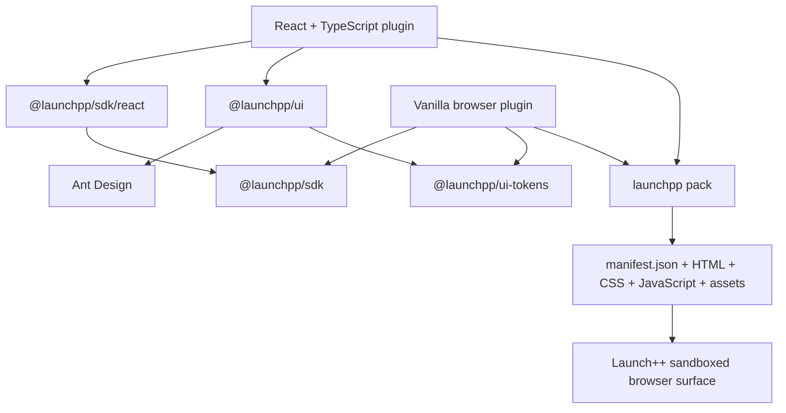

# Launch++ plugin UI system

Status: accepted v1 product and architecture direction. No UI package, plugin template, or runtime has been implemented.

This document owns the supported plugin authoring stacks and the relationship between React, vanilla browser code, Ant Design, Launch++ themes, and packaged plugin surfaces. The [plugin system](./plugin-system-design.md) owns runtime capabilities and isolation; the [plugin CLI](./plugin-cli-design.md) owns scaffolding and builds; the [theme system](./theme-system-design.md) owns the public visual-token contract.

## Decision

Launch++ v1 supports two browser authoring paths:

1. **React with TypeScript** is the recommended, documented, and best-supported experience.
2. **Vanilla HTML, CSS, and JavaScript or TypeScript** is a first-class framework-free experience.

Vue, Svelte, Angular, and additional UI-framework bindings are not v1 deliverables or commitments. The installed browser artifact remains ordinary HTML, CSS, JavaScript, and local assets, but that implementation boundary must not be confused with a promise to maintain authoring adapters for every framework.

This scope is intentional. Launch++ should spend its early engineering budget on plugin capabilities, permissions, storage, isolation, live development, diagnostics, packaging, and installation rather than duplicating UI bindings, examples, tests, and support across several frameworks.

## Package contract

| Package | Runtime | Responsibility |
| --- | --- | --- |
| `@launchpp/sdk` | Browser-standard JavaScript | Context, data, commands, events, storage, navigation, theme values, transport, and structured errors |
| `@launchpp/sdk/react` | React | Hooks, providers, lifecycle integration, and query conveniences over the core SDK |
| `@launchpp/ui` | React | Launch++-configured Ant Design components plus Launch++ product components |
| `@launchpp/ui-tokens` | CSS and static assets | Stable semantic custom properties, icons, motion values, and foundational styles for custom React and vanilla UI |

The core SDK must never require React. `@launchpp/ui` is intentionally React-only. `@launchpp/ui-tokens` does not turn native HTML into Ant Design components; it gives custom elements the same visual vocabulary.



## Why Ant Design

Ant Design supplies the broad component catalogue and interaction maturity required by the core application and third-party plugins: forms, validation, tables, trees, menus, dialogs, date controls, selectors, upload flows, loading states, feedback, internationalization, accessibility behavior, and motion. Its React implementation and theme-token system are documented by the project. [Ant Design for React](https://ant.design/docs/react/introduce/) [Customize theme](https://ant.design/docs/react/customize-theme/)

Using it lets the team concentrate on the extension platform rather than recreating a general-purpose React component library. Launch++ still owns its product identity through semantic tokens, theme mapping, composition, icons, density, and Launch-specific components.

The selected Ant Design version is pinned and upgraded deliberately. Plugins consume it through `@launchpp/ui`, not through internal application imports.

## `@launchpp/ui` design

`@launchpp/ui` is a thin, supported React distribution rather than an attempt to rewrite Ant Design.

It contains:

- Approved Ant Design components configured with Launch++ defaults
- The Launch++ theme provider
- Consistent empty, loading, error, forbidden, and unavailable states
- Product-aware components such as `TaskLink`, `MemberPicker`, `ProjectPicker`, and `PermissionNotice`
- Plugin boundaries such as `PluginErrorBoundary` and surface layout helpers
- The supported icon entry points

A plugin should use:

```tsx
import { Button, DatePicker, Form, Input, Modal, Table } from "@launchpp/ui";
import { useCurrentProject } from "@launchpp/sdk/react";
```

Official templates and documentation do not import `antd` directly, target `.ant-*` selectors, inspect Ant DOM structure, or depend on application-private React components. Direct Ant usage may work as an ordinary bundled browser dependency, but it is outside Launch++ compatibility guarantees and does not receive automatic host configuration.

The public package should expose the useful Ant catalogue without adding ceremonial wrappers around every component. Launch++ wraps or replaces a component only when it needs stable product semantics, safer plugin behavior, different defaults, or a deliberate API boundary.

## Host-rendered and plugin-rendered UI

Small contributions are declarative and host-rendered:

- Navigation entries
- Task and project actions
- Command-palette items
- Board-card badges and fields
- Standard settings fields

The plugin declares label, icon, placement, visibility, input schema, and command. Launch++ renders the control with the host's current `@launchpp/ui` version. These contributions automatically follow application upgrades and never load one React tree per small control.

Custom pages, substantial panels, dialogs, and rich settings experiences are plugin-rendered in sandboxed browser surfaces. A React surface may use `@launchpp/ui`; a vanilla surface uses native DOM elements, custom CSS, and `@launchpp/ui-tokens`. Both communicate through the same SDK bridge.

## Theme flow

Launch++ theme JSON is the source of truth. The resolver produces two coordinated representations:

```text
validated Launch++ theme
├── stable --launch-* CSS variables
└── Ant Design theme configuration used by ConfigProvider
```

The React build adapter generates the surface bootstrap that mounts the author's component inside the Launch++ provider. That provider applies the current Ant configuration and exposes the SDK context; authors only export their page or panel component. Vanilla and custom components receive the same resolved `--launch-*` variables. Theme changes are forwarded to active surfaces without a full application reload.

Plugin authors do not configure the application theme provider themselves. They may build completely custom React components and style them with the public variables:

```css
.sprint-card {
  color: var(--launch-color-text-primary);
  background: var(--launch-color-surface);
  border: 1px solid var(--launch-color-border);
  border-radius: var(--launch-radius-medium);
  transition: background-color var(--launch-motion-fast);
}
```

Ant's internal tokens and generated class names are implementation details. Only the Launch++ theme schema and `--launch-*` variables are stable plugin contracts.

## Scaffolding

The v1 CLI offers only the supported choices:

```text
Framework:
  React + TypeScript (recommended)
  Vanilla HTML + TypeScript
  Vanilla HTML + JavaScript
```

The React template includes the SDK bindings, `@launchpp/ui`, `@launchpp/ui-tokens`, an adapter-generated theme/context bootstrap used by both `dev` and `pack`, representative tests, and Vite configuration. The vanilla templates include the core SDK, tokens, DOM-level examples, tests, and Vite configuration.

React is an authoring dependency, not a requirement of the installed host contract. `launchpp pack` compiles either authoring path into the same normalized package shape:

```text
manifest.json
browser/
  surfaces/
    <surface-id>/
      index.html
      assets/
server/
schemas/
integrity.json
```

The package never contains source-framework configuration that the user's Launch++ server must execute. Installation does not run a package manager or compiler.

## Dependency and compatibility policy

The packer bundles eligible browser dependencies used by a custom surface and records the SDK and UI build versions in generated package metadata. It applies production tree-shaking and package-size limits so a plugin does not include unused parts of the Ant catalogue.

This gives compatibility two layers:

1. **Installed artifact compatibility.** An already packed plugin carries the implementation it was built and tested with. Replacing Ant inside a later `@launchpp/ui` release does not rewrite that archive.
2. **Source compatibility.** `@launchpp/ui` follows semantic versioning. Additive changes remain within a major line; incompatible component contracts require a new major version and a documented upgrade path.

The stable boundaries are the SDK protocol, manifest schema, generated browser artifact, Launch++ component API, and semantic CSS variables. Ant component internals are not stable boundaries.

The host retains compatibility fixtures for supported plugin/API versions. A current Launch++ release must either run an older supported package or reject it during installation with a precise compatibility error; it must not fail later with an unexplained blank surface.

## Vanilla support

Vanilla is not a hidden compatibility test. It is useful for declaration-heavy plugins, small custom panels, educational examples, and authors who do not want React.

Vanilla plugins receive:

- The complete framework-free SDK
- The same authenticated capability bridge
- The same manifest contributions
- The same typed storage and command contracts when using TypeScript
- The same theme variables and icons
- Safe iframe reload during development
- The same `check`, `test`, and `pack` pipeline

They do not receive React hooks or React/Ant components. A vanilla author uses native controls, custom components, or an independently bundled browser library and remains responsible for that custom UI's accessibility.

## Acceptance criteria

- [ ] A new React/TypeScript author renders a themed plugin page using `@launchpp/ui` without configuring Ant Design.
- [ ] A vanilla author renders a matching custom page using only `@launchpp/sdk` and `@launchpp/ui-tokens`.
- [ ] React and vanilla projects pack to the same normalized runtime contract.
- [ ] Theme switching updates host, React-plugin, and vanilla-plugin surfaces coherently.
- [ ] Direct application imports and dependencies on Ant class names fail `launchpp check` or produce an explicit unsupported-usage diagnostic.
- [ ] Unused Ant components are not included in a packed plugin surface.
- [ ] A supported older packed React plugin continues to run after a host UI-library upgrade.
- [ ] Host-rendered contributions always use the host's current components.
- [ ] The CLI, documentation, examples, and qualification suite cover React and vanilla only.

## Decisions captured

- React/TypeScript is the single supported component-framework path for v1.
- Vanilla HTML/CSS/JavaScript or TypeScript remains first-class.
- Other JavaScript frameworks are out of scope rather than partially supported.
- Ant Design powers the core React UI and `@launchpp/ui`.
- `@launchpp/ui-tokens` is the stable styling contract for custom React and vanilla UI.
- Plugin installation consumes normalized browser artifacts, never React source or a framework-specific `dist/` directory.
- Small contributions remain declarative and host-rendered; custom surfaces remain sandboxed.
- Existing packed plugins and public SDK/token contracts are protected independently of the host's future internal UI choices.
