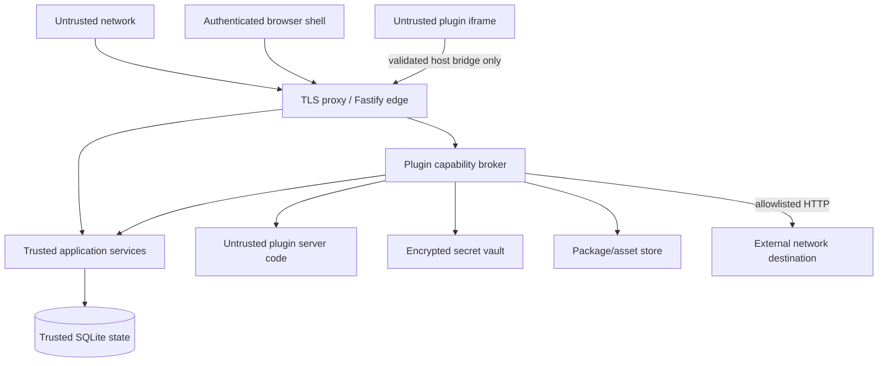

# Launch++ security and operations

Status: target controls and runbook requirements. A security claim is not complete until its implementation and adversarial tests exist.

## Security principles

1. **Deny by default.** Missing membership, grant, scope, schema, or policy means no access.
2. **Authorize at the use case.** HTTP, jobs, CLI commands, and plugins reach the same application services and policies.
3. **Treat extensions as separate principals.** A plugin has identity, provenance, grants, enabled scope, quotas, and audit history.
4. **Keep secrets out of clients and plugins.** Browser surfaces receive references or brokered results, never vault material.
5. **Minimize exposed infrastructure.** The default deployment needs one application port and one private data directory.
6. **Fail closed without destroying data.** An invalid plugin, theme, session, or update is paused/rejected while recoverable data remains intact.
7. **Make important actions attributable.** Permission, ownership, package, secret, export, restore, and deletion changes are audited.
8. **Prefer tested recovery over theoretical availability.** Backups and restore drills are stable-release requirements.

## Trust boundaries



The normal browser shell is trusted application code but all browser input remains untrusted. Plugin UI and server bundles are separate untrusted-code boundaries. Database, filesystem, and vault adapters are trusted computing base and should remain small.

## Threat model

### Assets

- Workspace tasks, comments, membership, plugin records, and exports
- User credentials, session tokens, invitations, and recovery tokens
- Integration credentials and encryption keys
- Plugin package identity, grants, signatures, and entitlement records
- Server configuration, backups, logs, and audit records
- Application availability and integrity

### Relevant threats

- A user reading or modifying another workspace by changing an ID
- A member escalating to administrator or installation operator
- CSRF, XSS, session theft, credential stuffing, and malicious uploads
- An installed plugin exfiltrating data or tunneling another plugin's permissions
- A package archive using path traversal, decompression bombs, or forged identity
- SSRF through plugin network requests or webhook configuration
- Malicious schema input causing excessive compilation or validation work
- Duplicate jobs/events producing repeated local or external effects
- A failed upgrade corrupting the database or making rollback impossible
- Backup theft or logs containing secrets and personal data
- Disk exhaustion from packages, assets, WAL growth, logs, or failed jobs

The project should maintain concrete abuse tests for these threats. A sandbox library name or CSP header alone is not evidence of containment.

## Authentication

Better Auth handles credential verification, sessions, verification tokens, and future linked identity providers. Launch++ accesses it through an `IdentityProvider` adapter so domain modules do not depend on Better Auth types.

### Initial authentication methods

- First owner created through a one-time setup flow.
- Email and password for ordinary accounts.
- Invitation-based workspace onboarding.
- Password reset only when mail is configured; otherwise an explicit operator recovery command.
- Social login, passkeys, two-factor authentication, and enterprise SSO follow after the core flow is secure and usable.

### Password and token policy

- Use the authentication library's reviewed password hashing configuration and track its upgrade guidance.
- Never log passwords, session tokens, reset tokens, invitation tokens, OAuth codes, or authorization headers.
- Store one-time token hashes, not recoverable raw tokens.
- Tokens have purpose, issuer, audience/scope, expiry, and one-time consumption where applicable.
- Authentication responses avoid revealing whether an account exists.
- Rate-limit sign-in, reset, invitation acceptance, and setup attempts by appropriate actor/IP keys.

### Sessions

- Browser sessions use `Secure`, `HttpOnly`, and appropriate `SameSite` cookies in production.
- Rotate session identifiers after sign-in, password change, privilege change, and account recovery.
- Revoke affected sessions when a user is suspended or removed.
- Show active sessions and allow a user to revoke them.
- Use short inactivity/absolute lifetimes appropriate to self-hosted collaboration, with configurable installation policy.
- Do not store bearer tokens in browser local storage.

The server validates trusted proxy configuration before deriving secure origin, client address, or HTTPS status. Arbitrary forwarded headers are ignored when the immediate proxy is not trusted.

## First-run setup

An uninitialized installation exposes only health and setup endpoints. Startup creates a short-lived, high-entropy setup token printed once to the local/operator console or read from a protected file. The first owner must present it before creating the installation identity and workspace.

After successful setup:

- The setup token is invalidated and removed.
- Setup routes return unavailable and cannot create a second owner.
- A security audit record captures time and installation version without recording the token.
- Reopening setup requires an explicit local operator recovery command with filesystem access.

Binding an uninitialized server to a public interface without a setup token is rejected.

## Authorization

Authorization is an application service, not a collection of ad hoc route checks. Policies accept an actor, operation, authoritative resource, workspace membership, project policy, and optional plugin context.

### Actor types

- Authenticated user
- Installation operator acting through an explicit operator endpoint/CLI
- Plugin service identity for background work
- System worker for narrowly defined internal projections
- Anonymous actor for login/setup/health endpoints only

### Rules

- Every workspace-owned service method requires `workspaceId` and actor context.
- Repositories support scoped access but do not decide product permissions.
- List queries apply access filters before counts and pagination.
- “Not found” and “not allowed” responses avoid confirming inaccessible resource existence.
- Installation operator capability is not implied by workspace ownership on shared/hosted deployments.
- Background plugin work uses its current grants, not the authority of whoever installed it.
- Selection and route context never grant access.
- Permission changes invalidate relevant caches, streams, and queued work promptly.

Policy tests use a matrix covering every role, resource state, project policy, actor type, and plugin entry point.

## Browser and HTTP security

### Origin and request controls

- Serve the production web client and API from one origin.
- Disable broad CORS by default; configure an exact allowlist only for approved future clients.
- Protect cookie-authenticated state changes with same-site policy plus origin/referer and CSRF token checks as appropriate.
- Accept only documented content types and enforce request/body/field limits before expensive work.
- Use route-specific rate limits stored locally for the single-node topology.
- Reject ambiguous duplicate parameters and unexpected schema properties.
- Apply deadlines and cancellation signals to request work.

### Security headers

The server emits a tested baseline including:

- Strict Content Security Policy with nonces/hashes where needed
- `frame-ancestors` preventing unauthorized embedding of the application
- `X-Content-Type-Options: nosniff`
- Restrictive referrer and permissions policies
- HSTS only when HTTPS and proxy trust are correctly configured
- Cache controls preventing storage of authenticated/private responses by shared caches

Plugin frames use their own more restrictive policy and sandbox flags. Their CSP is not weakened to satisfy arbitrary packages.

### XSS and content rendering

- React interpolation handles ordinary text; avoid raw HTML APIs.
- Markdown is parsed through a strict allowlist and sanitized after rendering.
- User links receive safe schemes and external-link behavior.
- SVG and HTML uploads are not served inline from the application origin by default.
- Plugin-provided labels, icons, errors, and metadata are untrusted values.
- Theme values are parsed into typed tokens and host-serialized; no arbitrary stylesheets.

## API protection

- Fastify validates every request and successful response against application-owned schemas.
- Unknown properties are rejected for security-sensitive inputs.
- Public IDs are opaque and still require resource authorization.
- Mutations use revision preconditions and idempotency where applicable.
- Batch size, search complexity, nesting, sort fields, and include expansions are bounded.
- Errors return stable codes and request IDs without internal detail.
- OpenAPI describes supported behavior but does not publish operator-only routes unless explicitly configured.
- Administrative endpoints require reauthentication or an operator channel for high-impact actions.

Uploaded plugin schemas are never blindly registered as Fastify route schemas. They pass a restricted schema dialect, depth/size checks, reference resolution policy, and bounded compilation/validation environment.

## Plugin security

The full design is in [plugin-system-design.md](./plugin-system-design.md). The minimum security model is:

### Package intake

1. Stream upload into quarantine with a strict compressed-size limit.
2. Compute the digest while receiving the archive.
3. Parse the archive using normalized paths; reject absolute paths, `..`, symlinks, hard links, duplicates, and device entries.
4. Enforce file-count, per-file, expanded-size, nesting, and compression-ratio limits.
5. Validate the manifest and every referenced entry without executing package code.
6. Verify declared digests and a publisher signature when present.
7. Check API compatibility, permissions, dependencies, and prohibited bundle imports.
8. Present provenance and permission review before installation.
9. Move the immutable package into content-addressed storage only after validation.

Archive integrity proves that bytes did not change; it does not prove that a publisher or package is trustworthy.

### Server execution

- The prototype is QuickJS/WASM inside supervised Node workers with fresh invocation contexts.
- Expose only serialized broker capabilities; no Node globals, process, filesystem, sockets, environment, native modules, or database handle.
- Enforce wall-clock deadline, instruction/interruption budget, memory budget, bridge-call count, request/response size, and log quotas.
- Terminate and replace a worker after timeout, memory violation, protocol violation, or uncertain state.
- Validate all input/output at the broker.
- Record grants and effective actor/scope with the invocation.
- Repeated failures trip a circuit breaker and pause the plugin.

A Node worker thread is a supervisor mechanism, not the sole security boundary. If the isolation prototype cannot demonstrate containment, public untrusted executable packages do not ship; operator-trusted execution remains clearly labeled.

### Browser execution

- Custom UI runs in a sandboxed opaque-origin iframe without same-origin or top-navigation privileges.
- Assets are bundled and served through a package-specific restricted origin/path and CSP.
- The bridge binds source window, frame instance, plugin ID, installation, active user, workspace/project scope, protocol version, and a nonce.
- Every message is schema-validated and rate/size limited.
- The host performs navigation, dialogs, clipboard, downloads, and external links through explicit capabilities.
- Direct network requests, form posts, images, popups, downloads, and navigation are tested for egress bypass.
- A frame is destroyed promptly when scope or authorization changes.

### Connected Developer Mode

Developer Mode is a temporary delivery path for unsigned local builds, not a relaxation of plugin security:

- It is disabled by default, can be enabled only by an installation operator, and shows a persistent warning while available.
- Pairing uses browser confirmation and a single-use, short-lived code. The resulting credential is bound to the operator-approved user, plugin ID, installation, development workspace and session.
- A connected build receives an ephemeral `dev:<session-id>:<plugin-id>` identity and never replaces the installed package or inherits its grants, secrets, records or provenance.
- Visibility is limited to the paired author by default. The default target is a dedicated development workspace with fixture or disposable data, not production workspace data.
- Permissions require explicit review. A permission or destination change pauses delivery until approved again.
- Browser and server code use the normal iframe isolation, capability broker, runtime quotas, schema validation and network policy.
- A remote CLI creates an outbound mutually authenticated TLS/WebSocket session and sends compiled incremental artifacts. The server cannot browse the author's filesystem or initiate access to localhost.
- Session credentials have short absolute lifetimes, are stored as secrets, are redacted from logs, and can be revoked from the CLI or server UI.
- Disconnect, expiry, user/session revocation, operator shutdown or disabling Developer Mode removes ephemeral contributions/assets, terminates handlers, revokes credentials and records an audit event.
- Development data follows an explicit disposable or retained-profile policy. Only disposable profiles may be reset after an incompatible schema change.

Abuse tests cover replayed pairing codes, stolen or expired session tokens, plugin-ID substitution, permission escalation, cross-user visibility, connection interruption, stale contribution cleanup and attempts to reach undeclared production data. Connected development does not bypass `check`, `test`, package validation or signed/provenance review for a release.

### Brokered network access

- Plugins declare exact HTTPS destinations or narrowly defined patterns.
- Resolve and validate every destination and redirect; block loopback, private, link-local, multicast, metadata, and disallowed ports.
- Protect against DNS rebinding by validating resolved addresses at connection time.
- Limit methods, headers, request/response bytes, redirects, concurrency, and duration.
- Inject credentials only on the server after destination validation.
- Strip hop-by-hop and sensitive host headers.
- Log destination, plugin, scope, timing, and result without secrets or full sensitive bodies.

Webhooks use random endpoint identifiers, signature verification where supported, replay windows, body limits, and a mapping to a specific installed plugin/workspace. Receiving a webhook does not grant caller-selected workspace context.

## Package and dependency supply chain

- Commit one pnpm lockfile and use frozen installs in CI/release builds.
- Pin production dependencies; use automated update proposals rather than floating deployment installs.
- Review install scripts and minimize dependencies with native code or broad maintenance risk.
- Generate a software bill of materials for release artifacts.
- Sign release images/artifacts and publish checksums.
- Scan dependencies and container images, triaging exploitability rather than treating counts as proof.
- Protect release workflows with least-privilege tokens, reviewed environments, and provenance where available.
- Never run `npm install` or package lifecycle scripts for uploaded plugins on the user's server.
- Bundle eligible plugin dependencies during author build and inspect the result during packaging.

## Secrets and encryption

### Secret classes

- Installation master key
- Session/auth secrets
- SMTP credentials
- OAuth provider secrets
- Plugin integration credentials
- Package registry or marketplace credentials
- Backup encryption keys

Configuration accepts secret values through environment variables, mounted secret files, or a future external secret provider. They are never written back into ordinary configuration files or returned through the API.

Plugin credentials are encrypted at rest with authenticated encryption under a versioned data-encryption key. Stored records contain ciphertext, nonce, algorithm/key version, scope, and audit metadata. The master key is kept outside the database and ordinary portable exports.

For local convenience, Launch++ may generate a protected key file in the data directory with a clear warning that a stolen full directory contains both key and data. VPS guidance uses a container/orchestrator secret or separately protected file. Disaster-recovery documentation must explain which key material is needed; “encrypted” backups that include an unprotected decryption key in the same archive provide little protection.

Key rotation rewraps data keys in bounded batches and retains prior key versions only for recovery. Losing all master-key material makes integration secrets intentionally unrecoverable; core project data remains restorable.

## Data privacy and logs

- Collect only data required for product operation.
- Telemetry export is off by default for self-hosted installations.
- Structured logs use an allowlist of fields and redact cookies, tokens, credentials, query bodies, comment/task contents, and plugin secret values.
- User-facing diagnostic bundles show exactly what will be included and permit inspection before download.
- Crash reporting, if configured, is an explicit operator choice with documented fields and destination.
- Portable exports list included categories and exclude credentials/session data.
- Account/workspace deletion follows published retention behavior and includes extension-owned linked data.

## Audit records

Security audit entries cover:

- Sign-in security events and session revocation
- First-owner setup and operator recovery
- Membership, role, and ownership changes
- Project access policy changes
- Plugin upload, provenance decision, permission approval, enable/disable/update/purge
- Secret creation/use metadata/rotation/deletion without secret values
- Workspace exports, backups, restores, and permanent deletion
- Configuration changes performed through Launch++

Audit entries include actor, operation, target, time, request/correlation ID, source address summary where policy permits, outcome, and bounded metadata. They are append-oriented and protected from ordinary workspace editing. Operators can configure retention/export; a plugin cannot alter its audit trail.

## Configuration model

Configuration is parsed once at startup into a typed immutable object. Unknown variables produce a warning or error according to strictness; malformed or unsafe values fail before readiness.

Representative settings:

| Variable | Purpose |
| --- | --- |
| `LAUNCHPP_BASE_URL` | Canonical external origin |
| `LAUNCHPP_BIND_ADDRESS` | Listen address; defaults safely for local mode |
| `LAUNCHPP_PORT` | HTTP port |
| `LAUNCHPP_DATA_DIR` | Explicit persistent data directory |
| `LAUNCHPP_DATABASE_PATH` | SQLite path inside data directory |
| `LAUNCHPP_MASTER_KEY_FILE` | Mounted encryption-key path |
| `LAUNCHPP_TRUSTED_PROXIES` | Exact proxy addresses/ranges |
| `LAUNCHPP_LOG_LEVEL` | Structured log severity |
| `LAUNCHPP_SMTP_*` | Optional mail adapter configuration |
| `LAUNCHPP_BACKUP_DIR` | Backup destination when local backup is enabled |
| `LAUNCHPP_PLUGIN_POLICY` | Disable, trusted-only, or approved packages according to supported modes |
| `LAUNCHPP_TELEMETRY_ENDPOINT` | Optional OpenTelemetry export destination |

Names remain provisional until implementation. Secrets prefer `_FILE` inputs. The application never uses unresolved shell variables to construct destructive filesystem targets.

## Data directory

Proposed layout:

```text
data/
├── database/
│   └── launchpp.sqlite
├── packages/
│   └── sha256/
├── assets/
│   └── sha256/
├── backups/
├── run/
│   └── installation.lock
└── keys/
    └── local-master.key
```

The application validates that configured paths resolve under the intended data root unless an operator explicitly configures an external store. Files use least-privilege ownership; package/asset filenames come from content digests, never raw uploaded paths.

Temporary uploads and extraction use dedicated random directories with quotas and are removed on success/failure. A cleanup task handles abandoned quarantine directories without traversing outside the configured root.

## Supported deployment profiles

### Developer

- Node.js 24 LTS and pnpm
- Vite development server proxied to Fastify
- Disposable or seeded SQLite database
- Fake mail and integration adapters
- Local plugin development bridge using production protocol and isolation settings

### Local user

- Packaged Launch++ runtime or container
- Loopback binding by default
- One local data directory
- Automatic reviewed core/auth migrations with a pre-upgrade backup once the product is stable
- No mail required for a solo owner

### VPS

- One non-root Launch++ container/process
- Local persistent SSD volume
- Caddy, nginx, or equivalent reverse proxy for TLS
- Explicit canonical URL and trusted proxy configuration
- Scheduled off-machine encrypted backups
- Optional SMTP provider
- Resource and disk monitoring

The container filesystem is read-only except for the data and bounded temporary locations. It has no Docker socket, host root mounts, or unnecessary Linux capabilities. Published images support documented architectures and include compatible native SQLite binaries.

### Not supported initially

- Multiple application replicas writing one SQLite database
- SQLite on NFS/shared network storage
- Multi-region active-active operation
- Serverless request runtimes with ephemeral local disks
- Kubernetes as the primary installation path
- Running uploaded plugin code directly in the Node application context

## Health and readiness

- `/health/live` reports whether the process event loop and HTTP server are alive; it performs no deep dependency work.
- `/health/ready` verifies configuration, migration compatibility, writable database, package-store access, and critical startup reconciliation.
- Authenticated operator diagnostics report queue depth, oldest outbox/job age, disk space, WAL/checkpoint state, package/runtime health, mail configuration, and backup status.
- Detailed errors and paths are never exposed on public unauthenticated health endpoints.

Readiness turns false before graceful shutdown, during incompatible migrations, or when the server cannot safely accept writes. A failing optional plugin does not make core readiness false.

## Logging, metrics, and tracing

### Logs

Every request receives a correlation ID. Structured entries include service/module, route template, status, duration, actor type and opaque ID where appropriate, workspace ID where authorized, and error code. High-cardinality payloads and personal content are excluded.

Plugin logs are tagged by package, workspace, invocation, and severity, with per-invocation byte/count limits. Authors see scoped logs; installation operators can inspect system-level failure context.

### Metrics

Initial metrics include:

- HTTP rate, latency, status, and active requests
- SQLite transaction latency, busy retries, file/WAL size, and checkpoint duration
- Outbox/job queue depth, oldest age, attempts, and dead letters
- SSE connections, reconnects, and dropped/reset cursors
- Plugin invocation count, duration, timeout, memory termination, and circuit state
- Package/asset storage and disk free space
- Backup age, duration, size, and verification outcome

Metrics export is optional and access-controlled. Labels avoid raw user IDs, task IDs, emails, or unbounded plugin-generated values.

### Tracing

Trace context follows HTTP requests, application services, database spans, outbox correlation, and brokered plugin invocations. External HTTP spans redact credentials and sensitive URL parameters. OpenTelemetry export is optional; local operation does not require a collector.

## Backup and restore

### Backup procedure

1. Verify destination capacity and permissions.
2. Use an online consistent SQLite snapshot; do not copy an active main file alone.
3. Capture packages and assets by digest, avoiding duplicate content where the backup format permits.
4. Include an installation manifest, schema/application versions, configuration inventory, and checksums.
5. Encrypt when leaving the host or according to operator policy.
6. Verify checksums and run an SQLite integrity check on a restored temporary copy.
7. Record successful backup metadata and expire old sets by policy.

Recommended VPS policy begins with daily off-machine backups plus a pre-upgrade backup; actual recovery point requirements belong to the operator. The UI must report the last verified backup, not merely the last attempted backup.

### Restore procedure

1. Put the target installation in maintenance mode and stop writers.
2. Verify archive integrity, version support, and required key material.
3. Restore into a new staging directory, never over the only live copy.
4. Run database integrity and package/asset digest checks.
5. Start the compatible application against staging and run health checks.
6. Atomically switch the configured data location or perform an explicit controlled replacement.
7. Retain the prior data directory until post-restore verification and operator confirmation.

Release qualification includes a restore drill on documented reference environments.

## Updates and rollback

Application update flow:

1. Download/verify signed artifact or image digest.
2. Check target compatibility and required free disk space.
3. Enter maintenance for migrations that require exclusive writes.
4. Create and verify a pre-upgrade backup.
5. Run ordered core/auth migrations with a journal.
6. Reconcile plugin compatibility without executing incompatible plugins.
7. Start the new version and run readiness/smoke checks.
8. Leave maintenance only after success.

If no schema change occurred, rollback can redeploy the prior artifact. If schema changed, rollback requires a compatible reverse migration or restore of the pre-upgrade snapshot. The updater must never imply that switching a container tag alone reverses a destructive migration.

Plugin updates have their own staged lifecycle and cannot make the core unavailable. New plugin permissions always require review.

## Capacity and performance operations

Reference benchmarks must include a modest laptop and VPS with documented CPU, memory, storage, browser, dataset, and concurrent-user profile. Measure:

- Cold/warm startup and migration time
- Board/list/search p50/p95/p99 latency
- Task mutation and concurrent writer contention
- WAL growth/checkpoint behavior
- Export/import and backup/restore duration
- Outbox lag and retry storms
- Plugin cold start, steady memory, timeout termination, and UI bridge throughput
- Browser bundle size, route load, long tasks, and large-board interaction

The application enforces quotas for package size, asset size, plugin records, job backlog, logs, and export concurrency. Limits are configuration with safe supported ranges, not undocumented constants.

## Operational failure playbooks

| Symptom | First safe response |
| --- | --- |
| Core readiness fails after upgrade | Keep maintenance enabled; inspect migration journal; restore staging/backup if compatibility demands it |
| SQLite reports busy frequently | Identify long transactions/readers and checkpoint state; do not raise timeout indefinitely |
| WAL or disk grows rapidly | Pause uploads/background work, inspect checkpoints/readers, preserve files, free capacity safely |
| Outbox backlog grows | Keep core available, inspect failing consumer, pause optional plugin consumer, replay after fix |
| Plugin crash loop | Circuit-break and disable that plugin runtime; retain data and export access |
| Secret key unavailable | Keep core data available where possible; integrations remain disconnected until key recovery |
| Suspected credential leak | Rotate affected secret/session, revoke grants, audit use, preserve incident evidence |
| Corrupt package asset | Mark package unhealthy, restore by digest from trusted source/backup; do not execute partial package |
| Failed backup verification | Mark backup failed, retain prior verified backup, alert operator, investigate before expiry |

## Security and operations release gates

- [ ] Cross-workspace authorization tests cover every resource family and plugin entry point.
- [ ] CSRF, origin, cookie, proxy, and session rotation behavior is tested in production topology.
- [ ] Markdown, uploads, theme tokens, and plugin package parsing have malicious fixtures.
- [ ] SSRF defenses cover redirects, DNS rebinding, IPv4/IPv6 private ranges, and metadata endpoints.
- [ ] Plugin infinite loop, allocation, output flood, bridge flood, and browser egress attempts are contained.
- [ ] Connected Developer Mode resists pairing replay, grant escalation, cross-user visibility, stale-session reuse, and incomplete teardown.
- [ ] Secrets and representative user content do not appear in logs, errors, traces, or diagnostic bundles.
- [ ] Release artifacts have checksums, an SBOM, vulnerability review, and reproducible build metadata.
- [ ] A live-style backup is restored and verified before stable release.
- [ ] Disk exhaustion and WAL growth produce actionable alerts without silent corruption.
- [ ] Failed core migrations and plugin schema-evolution preparation preserve a documented recovery path.
- [ ] The app starts safely with all optional plugins disabled.
