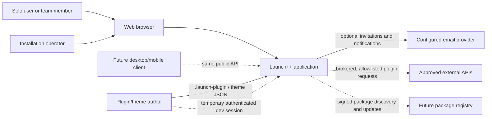
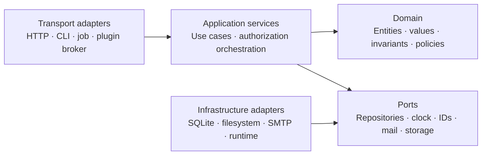
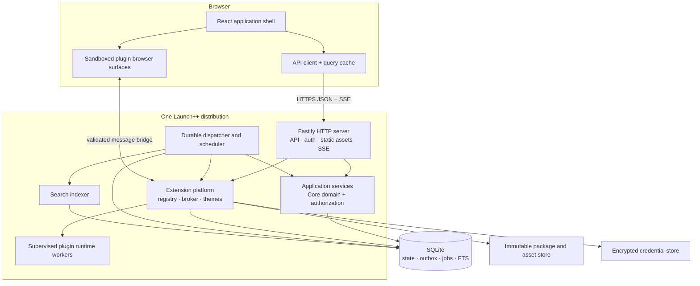
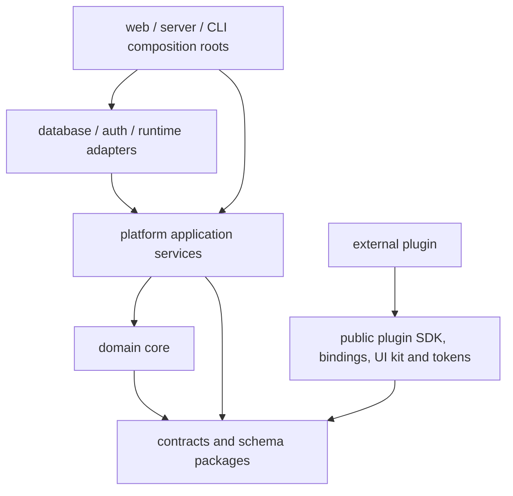
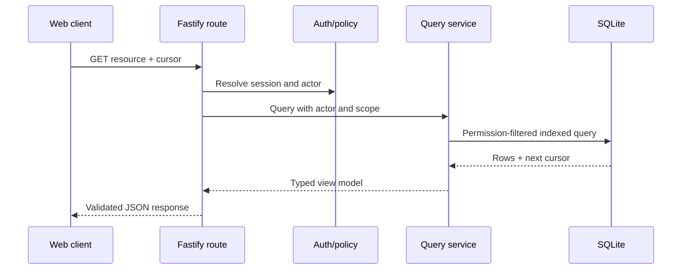
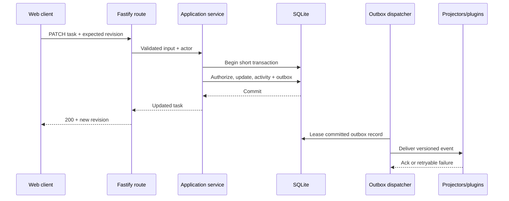
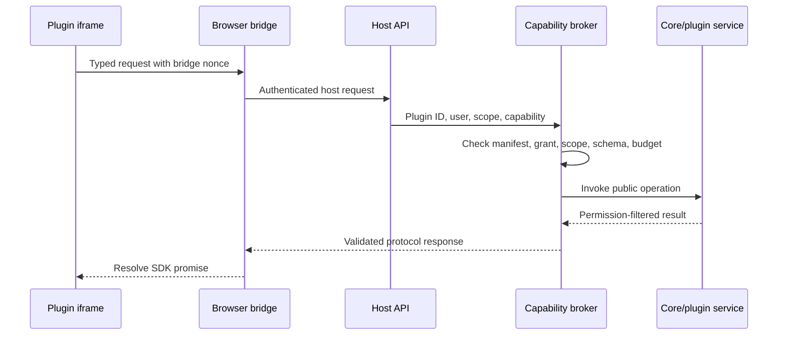
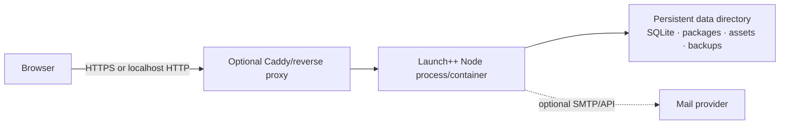

# Launch++ system architecture

Status: target architecture for implementation. This document defines system-wide boundaries; detailed plugin and theme contracts live in their dedicated documents.

## Executive summary

Launch++ is a TypeScript modular monolith delivered as one self-hostable application. A React single-page client and future clients call a versioned Fastify HTTP API. Application services enforce domain rules and authorization before repositories persist state in SQLite. The same transaction records an outbox entry for activity, search, notifications, real-time invalidation, and plugin event delivery.

Optional behavior is kept outside the domain core. Declarative plugin contributions are rendered by the host; custom browser-standard HTML/CSS/JavaScript surfaces run in sandboxed frames; server plugin handlers run behind a capability broker in a supervised isolated runtime. React/TypeScript is the recommended component authoring path and vanilla browser code is the framework-free path; the installed host contract requires neither. Themes are validated JSON tokens resolved into CSS variables and Ant Design theme configuration. Neither extension mechanism receives direct access to the database, process, filesystem, session cookies, or internal frontend state.

The first deployment has one server process, one database file, one local data directory, and no mandatory external services. Internal interfaces keep the web server, job runner, package store, mail provider, and database adapter separable without turning them into microservices prematurely.

## Architectural drivers

### Goals

- Preserve a genuinely small, useful project-management core.
- Make React/TypeScript plugin development feel like ordinary application development while supporting a direct vanilla browser path.
- Keep local use and VPS hosting operationally simple.
- Make workspace data portable across installations.
- Allow the product to evolve without making application internals a public API.
- Contain optional plugin failure so core work remains available.
- Provide predictable authorization and audit behavior across UI, API, jobs, and plugins.
- Serve a future hosted product and desktop client through the same backend contract.

### Constraints

- The initial team and community should be able to reason about the whole system.
- SQLite allows concurrent readers but still serializes writers; transactions must be short.
- Plugin code is untrusted only after the proposed isolation model passes adversarial testing.
- The server plugin runtime cannot promise arbitrary Node.js package compatibility.
- The browser client is online-first; offline mutation synchronization is not part of v1.
- A single-node deployment is the supported v1 topology.
- The current repository has no implementation to preserve.

## System context



Launch++ is the system of record for accounts, workspaces, projects, tasks, comments, extension configuration, and extension-owned data. External integrations are optional and reached only through explicit adapters or plugin network capabilities.

## Architecture style

### Modular monolith

All first-release modules are built and deployed together but have explicit ownership and import rules. A module exposes application services and events; it does not expose database tables as a cross-module API.

This provides:

- One installation and upgrade unit
- Local transactions across core modules
- Straightforward debugging and backups
- Low infrastructure cost
- The ability to extract a process later at a stable port rather than at an arbitrary code seam

It does not mean one unstructured server folder. Package boundaries, architecture tests, service APIs, and a composition root enforce modularity.

### Layering inside a module



The domain layer is pure TypeScript and does not import Fastify, React, Drizzle, Better Auth, filesystem APIs, or plugin packages. Application services define transaction boundaries. Adapters satisfy ports. The server composition root creates concrete implementations and wires them together.

Use this structure where it protects a real boundary. Small value objects and closely related use cases may remain together; avoid ceremonial one-class-per-file architecture.

## Container architecture



The dispatcher may run as a supervised loop in the server process initially. Its lease and shutdown contracts must allow it to move to a separate process later without changing event semantics.

## Module map

### Domain core

| Module | Responsibility | Publishes |
| --- | --- | --- |
| Identity | Launch++ user profile linked to authentication identity | Profile lifecycle facts |
| Workspaces | Workspace lifecycle, ownership, membership, roles | Workspace and membership facts |
| Projects | Project lifecycle, project policy, ordered statuses | Project/status facts |
| Tasks | Tasks, subtasks, ordering, assignments, labels, due dates | Task facts |
| Comments | Task discussion and edit/delete policy | Comment facts |
| Activity | Human-readable, permission-filtered history | Read model only |
| Search | Permission-aware indexing and query | Search results |
| Notifications | In-app delivery and read state | Notification state |

### Platform modules

| Module | Responsibility |
| --- | --- |
| Authorization | Central policy evaluation for users, service identities, resources, and plugin scopes |
| API contracts | Versioned request/response schemas, errors, pagination, and generated client inputs |
| Persistence | Database adapter, transaction manager, migrations, and repository implementations |
| Outbox and jobs | Durable post-commit events, retries, schedules, leases, and dead-letter diagnostics |
| Plugin protocol | Manifest, RPC, contribution, permission, command, event, and storage schemas |
| Plugin manager | Package staging, provenance, compatibility, install/update/disable/uninstall lifecycle |
| Plugin broker | Scoped capability enforcement and calls between UI, handlers, core services, and plugins |
| Plugin runtime | Server handler execution, deadlines, memory limits, cancellation, and diagnostics |
| Extension registry | Resolved pages, actions, fields, panels, settings, slots, and enablement |
| Theme platform | Theme validation, selection, resolution, and CSS-variable contract |
| Package store | Immutable plugin archives, normalized browser documents/assets, metadata, and integrity hashes |
| Secret vault | Encrypted external credentials and scoped credential references |
| Asset storage | Avatars and future attachments behind local/S3-compatible ports |
| Observability | Structured logs, metrics, traces, audit export, and diagnostics |

### Dependency rules



- Core modules never import plugin implementations.
- External plugins import only published SDK, optional framework bindings/UI packages, token packages, and generated capability packages.
- The web client imports API contracts and generated clients, never repositories.
- Database schemas stay in the persistence package and are not domain types.
- Cross-module reads use services or explicit read-model ports, not another module's Drizzle table.
- Circular workspace package dependencies fail CI.

## Technology stack

Versions are pinned during bootstrap. The major-version baseline reflects the selected stack as of September 2026.

### Runtime and repository

| Concern | Selection | Reason |
| --- | --- | --- |
| Language | TypeScript, strict mode | One language across app, SDK, tooling, and plugins |
| Runtime | Node.js 24 LTS | Production LTS and strongest compatibility for the selected server/runtime APIs |
| Modules | Native ESM | Standard modern Node and browser package model |
| Package manager | pnpm 12 workspaces | Strict dependencies, workspace protocol, one lockfile |
| Task orchestration | pnpm workspace scripts initially | Avoid an extra build system until task graph/caching justifies one |
| Formatting/linting | Biome plus `tsc --noEmit` | Fast consistent formatting/basic lint with compiler type checks |
| Versioning | Changesets for publishable SDK packages | Explicit changelogs and independent public package releases |

Node's own release guidance recommends production applications use LTS lines. pnpm provides native monorepo and `workspace:` dependency support. [Node.js releases](https://nodejs.org/en/about/previous-releases), [pnpm workspaces](https://pnpm.io/workspaces)

### Backend

| Concern | Selection | Reason |
| --- | --- | --- |
| HTTP server | Fastify 5 | Low overhead, encapsulated modules, built-in Pino integration, schema-first API |
| Contract schemas | TypeBox + JSON Schema | Runtime validation and TypeScript inference from one application-owned schema |
| API documentation | `@fastify/swagger` + OpenAPI 3.1 output | Human docs and generated clients |
| Authentication | Better Auth behind `IdentityProvider` port | Self-hosted sessions, framework/database integration, future auth methods |
| Authorization | Launch++ policy service | Workspace/project/plugin permissions are product rules, not delegated to auth library |
| Database | SQLite with WAL, foreign keys, busy timeout | Minimal local/VPS operations and transactional durability |
| SQLite driver | `better-sqlite3` | Mature Node driver with transaction and worker support; package prebuilds in distribution |
| ORM/query builder | Drizzle stable line | Typed schema/query layer with reviewable SQL and migration tooling |
| Search | SQLite FTS5 | No separate search service for initial scale |
| Jobs/events | Transactional outbox + database leases | Durable work without Redis or a broker |
| Logging | Pino structured JSON | Fastify-native request correlation and machine-readable logs |
| Telemetry | OpenTelemetry adapter, opt-in export | Vendor-neutral traces/metrics without requiring a collector |

Fastify can infer TypeScript types from JSON Schema through official type providers. Only trusted application schemas are registered with Fastify's compiled validator; uploaded plugin schemas are linted and compiled in a bounded validation path because route-schema compilation treats schemas as code. [Fastify type providers](https://fastify.dev/docs/latest/Reference/Type-Providers/), [Fastify validation](https://fastify.dev/docs/latest/Reference/Validation-and-Serialization/)

Drizzle supports SQLite through `better-sqlite3` and other drivers. Launch++ will pin a tested stable Drizzle line rather than adopting a beta automatically. Production uses committed migrations; schema push is development-only. [Drizzle SQLite support](https://orm.drizzle.team/docs/get-started/sqlite-new)

### Frontend

| Concern | Selection | Reason |
| --- | --- | --- |
| Host UI framework | React 19 | Stable application component model and recommended plugin authoring ecosystem; not part of the plugin wire contract |
| Build/dev server | Vite 8 | Fast SPA tooling and library build support for UI/SDK packages |
| Routing | React Router | Nested layouts, deep links, error boundaries, future data-router options |
| Server state | TanStack Query | Request cache, invalidation, cancellation, retries, and mutation lifecycle |
| Local UI state | React state/context; Zustand only for cross-route shell state | Avoid duplicating server state in a global store |
| Component system | Ant Design behind `@launchpp/ui` | Broad, mature React component coverage for the product and plugin authors without rebuilding a general-purpose library |
| Styling | Ant Design theme configuration plus scoped product CSS over semantic Launch++ variables | Keep vendor internals private while supporting custom React and vanilla surfaces |
| Forms | React Hook Form integrated with shared schemas | Performant forms with explicit server validation |
| Icons | One curated SVG icon set behind `@launchpp/ui` | Visual consistency and tree-shaking |
| Testing | Vitest + Testing Library + Playwright | Unit/component/contract coverage and real browser journeys |

The public React design-system contract is `@launchpp/ui`, not application internals or Ant class names. Custom React and vanilla plugins use `@launchpp/ui-tokens` for semantic CSS variables, icons and foundational styles. The theme resolver maps the same source tokens into Ant Design configuration for React components and stable `--launch-*` variables for custom UI. The detailed contract is defined in [Plugin UI system](./plugin-ui-system.md). React 19 is the current React major and Vite 8 is the selected supported build line. [React versions](https://react.dev/versions), [Vite releases](https://vite.dev/releases)

### Plugin and theme tooling

| Concern | Selection | Reason |
| --- | --- | --- |
| Plugin browser build | Vite-based React/TypeScript and vanilla adapters | Focused supported authoring with normalized self-contained HTML surfaces and deterministic assets |
| Browser isolation | Sandboxed iframe + strict CSP + validated `postMessage` bridge | Separates custom UI from shell origin and internals |
| Server isolation prototype | QuickJS compiled to WASM in supervised Node workers | Narrow JavaScript environment with explicit host capabilities |
| Package format | Deterministic ZIP-compatible `.launch-plugin` archive | Uploadable, hashable, signable, and inspectable |
| Live development | Disposable host or operator-enabled authenticated dev channel | Fast feedback without making framework dev output the install contract |
| Manifest/theme validation | Versioned JSON Schema | Static inspection and editor completion |
| Theme runtime | Typed JSON tokens to host-generated CSS variables | No executable theming path |

## Backend design

### Fastify composition

Fastify route modules are transport adapters. A route performs the following only:

1. Validate headers, parameters, query, and body against an application-owned schema.
2. Resolve the session and request context.
3. Call one application use case.
4. Map a typed result or domain error into the documented response schema.
5. Return without embedding SQL or plugin logic.

Fastify lifecycle hooks provide correlation IDs, request logging, security headers, origin/CSRF checks, authentication context, rate limits, and response timing. Business authorization stays in application services so CLI, jobs, and plugin calls cannot bypass it.

### Application service contract

A typical mutation has explicit dependencies and one transaction boundary:

```ts
type MoveTask = (input: {
  actor: Actor;
  workspaceId: WorkspaceId;
  taskId: TaskId;
  statusId: StatusId;
  expectedRevision: number;
  idempotencyKey?: string;
}) => Promise<TaskView>;
```

The implementation loads authoritative membership and task state, calls authorization, applies domain invariants, persists the new revision, appends activity/outbox records, and commits. It does not wait for notifications or plugin handlers.

### Transaction ownership

Application services request a unit of work from the persistence port. Repository methods participating in that unit share a transaction. Arbitrary plugin code, email, HTTP calls, and long computations never execute while a database transaction is open.

SQLite writes are serialized intentionally through short transactions and a configured busy timeout. Long reports and FTS rebuilds use bounded batches or worker threads. WAL is stored on a local filesystem, never an unsafe network filesystem; SQLite documents that WAL permits readers with a writer but only one writer at a time and depends on same-machine shared memory. [SQLite WAL](https://www.sqlite.org/wal.html)

### Authentication and identity

Better Auth owns credentials, verification, linked identity providers, and sessions. Launch++ owns profiles, workspace membership, roles, invitation state, and resource authorization. An adapter maps an authenticated Better Auth user ID to a Launch++ actor.

The web app uses secure, HTTP-only, same-site cookies on the same origin as the API. API tokens and external identity providers are later auth adapters, not alternative authorization systems. The selected auth library has an official Fastify integration and database-backed session model. [Better Auth Fastify integration](https://better-auth.com/docs/integrations/fastify), [Better Auth database model](https://better-auth.com/docs/concepts/database)

### Authorization

Every use case evaluates:

```text
installation policy
  ∩ actor identity and workspace role
  ∩ resource/project access
  ∩ operation-specific policy
  ∩ plugin grant and enabled scope, when applicable
```

Authorization uses authoritative IDs loaded from storage. A project ID or workspace ID received from the browser or plugin is context, never proof of access. Query services apply visibility filters before pagination and counting so hidden rows cannot leak through totals or timing-sensitive follow-up queries.

### Outbox, jobs, and event delivery

Domain transactions append versioned outbox facts. A dispatcher leases committed entries and routes them to activity projectors, FTS indexing, in-app notifications, SSE invalidation, and eligible plugin subscribers.

- Delivery is at least once.
- Consumers record stable effect/idempotency keys.
- Retries use exponential backoff with jitter and a maximum attempt policy.
- Failed work remains inspectable and replayable by an operator.
- Jobs have `available_at`, lease owner, lease expiry, attempt count, and cancellation state.
- Scheduled work declares missed-run behavior; an asleep laptop does not create an uncontrolled backlog.
- Plugin jobs run under the plugin service identity and current grants.

No module promises exactly-once external side effects. Integrations use provider idempotency keys or reconciliation.

## Frontend design

### SPA shell

The authenticated product is a client-rendered SPA. Search-engine rendering has little value for private workspace screens, while one static build simplifies local hosting, plugin surface composition, and a future desktop wrapper. A separate marketing site can use a different rendering strategy later.

The Fastify server serves fingerprinted static assets and the SPA fallback from the same origin. This avoids production CORS for the main client and simplifies secure cookie sessions.

### Route model

The product-level page hierarchy and responsive behavior are defined in [UI information architecture](./ui-information-architecture.md). Proposed stable URL shapes are:

```text
/setup
/sign-in
/sign-up
/recover
/invite/:token
/w/:workspaceSlug/home
/w/:workspaceSlug/members
/w/:workspaceSlug/p/:projectKey/:viewId
/w/:workspaceSlug/p/:projectKey/tasks/:taskId
/w/:workspaceSlug/x/:pluginId/:pagePath
/w/:workspaceSlug/p/:projectKey/x/:pluginId/:pagePath
/w/:workspaceSlug/settings/:section
/w/:workspaceSlug/p/:projectKey/settings/:section
/account/:section
/admin/:section
```

The `viewId` resolves permanent core views such as Board/List or a registered host-owned plugin view. Slugs and keys are navigation conveniences. APIs use opaque immutable IDs resolved and authorized by the server. Plugin route suffixes are declared and host-owned so a disabled plugin produces a controlled unavailable state rather than a broken router import. A task route may render as a panel over its originating project route on wide screens while remaining independently deep-linkable.

### State ownership

| State kind | Owner |
| --- | --- |
| API resources and lists | TanStack Query cache |
| Authenticated actor/session | Auth client plus query cache |
| URL-addressable filters and selection | Router search parameters/path |
| Temporary component interaction | Local React state |
| Cross-route shell state | Small internal store if React context is insufficient |
| Draft form state | Form library/component state |
| Plugin local state | Inside sandboxed plugin surface |
| Plugin shared state | Host APIs and plugin collections |

Do not copy query results into a global client store. The SSE channel delivers typed invalidation hints, not arbitrary replacement state. The client invalidates or patches known query keys and can refetch authoritative data.

### Design system

`@launchpp/ui` contains Launch++-configured Ant Design components and product components. Internal application code uses the same components exposed to React plugins where the public contract is appropriate. `@launchpp/ui-tokens` contains the browser-standard semantic CSS variables, icons and foundational styles used by custom React and vanilla surfaces. Ant-generated class names, DOM structure and internal tokens are implementation details and are not plugin APIs.

Every component documents keyboard behavior, focus management, supported density, loading/error/empty states, responsive behavior, and allowed extension slots. Visual snapshots supplement but do not replace interaction tests.

### Optimistic updates

Use optimistic updates for reversible, low-conflict changes such as moving a task or changing a label. Send the current revision; roll back and show a structured conflict if another actor changed the record. Creation with server-generated IDs may use client-generated UUIDs where the API contract explicitly accepts them.

Comments, destructive actions, plugin commands with external effects, and ambiguous batch operations wait for server confirmation.

## Plugin subsystem integration

The [plugin system design](./plugin-system-design.md) is the detailed runtime contract. [Plugin storage](./plugin-storage-design.md) defines typed data and automatic safe schema evolution, while the [plugin CLI](./plugin-cli-design.md) defines the author workflow. At the system level the host has seven cooperating parts:

1. **Package manager** validates and stages immutable archives.
2. **Extension registry** resolves enabled declarative contributions for the current workspace/project.
3. **UI bridge** initializes sandboxed surfaces and validates every message.
4. **Capability broker** maps allowed SDK calls to ordinary application services.
5. **Runtime supervisor** invokes server handlers with time, memory, call, and output budgets.
6. **Lifecycle manager** installs, applies compatible host-owned schema evolution, enables, pauses, updates, disables, exports, and purges.
7. **Development session manager** pairs an operator-approved CLI, registers ephemeral author-scoped builds, and guarantees expiry and teardown.

Plugins never become Fastify route modules and never receive a database handle. Browser surfaces always arrive as normalized HTML/CSS/JavaScript documents; framework-specific compilation remains on the author's machine. Authors declare collections in `data/schema.ts`; the CLI emits a static schema and generated clients, and the host owns storage/index changes. Plugin packages contain no SQL or author-maintained migration files. Core mutations reached through a plugin use the same authorization, validation, activity, outbox, and idempotency paths as first-party UI.

The exact QuickJS/WASM wrapper and browser confinement are feasibility decisions. Until adversarial fixtures pass, third-party executable plugins must be labeled operator-trusted or remain disabled; declaration-only plugins and themes do not need that runtime claim.

## Theme subsystem integration

The [theme system design](./theme-system-design.md) is the detailed contract. Theme JSON is validated on import, normalized, stored immutably, resolved against a built-in base, and delivered as CSS variables. Built-in themes use the same resolver. Sandboxed plugin UI receives the resolved theme through initialization and change messages.

Theme selection is a user preference with workspace defaults. Invalid or missing themes fall back to a built-in appearance. No theme value is concatenated into arbitrary raw CSS.

## Core request flows

### Authenticated read



### Core mutation and asynchronous consequences



### Custom plugin UI call



## Runtime lifecycle

### Startup order

1. Parse and validate configuration; reject unknown or insecure production combinations.
2. Acquire an installation lock preventing two unsupported writers on the same SQLite directory.
3. Open SQLite, enable foreign keys, confirm WAL mode and supported SQLite capabilities.
4. Verify migration state; apply migrations only under the configured upgrade policy.
5. Initialize encryption keys, auth adapter, package store, and built-in schemas.
6. Load installed package metadata without executing handlers.
7. Reconcile enabled extension registries and pause incompatible packages.
8. Start HTTP readiness only after core reads/writes are safe.
9. Start dispatcher/scheduler leases.

### Graceful shutdown

1. Mark readiness false and stop accepting new requests.
2. Close SSE streams with a reconnect instruction.
3. Stop taking new jobs and plugin invocations.
4. Allow bounded in-flight core requests to finish.
5. Cancel or expire plugin runtime work.
6. Release job leases, checkpoint according to policy, close database and package handles.
7. Exit non-zero if integrity-sensitive shutdown steps fail.

Jobs and event deliveries remain retryable after process termination; correctness does not depend on an in-memory acknowledgement.

## Deployment topology

### Local and small-team VPS



Local native packaging and Docker use the same server artifact and data layout. A reverse proxy terminates TLS on a VPS; localhost may bind only to loopback. The SQLite database and its WAL/SHM files live on local persistent storage, not an NFS volume.

### Future hosted scale

Do not implement this topology before it is needed. Stable ports permit these changes:

- Replace SQLite repositories with PostgreSQL after compatibility work.
- Move assets/packages to S3-compatible object storage.
- Run dispatchers as separate processes using database leases.
- Add a shared real-time fanout adapter if multiple API replicas are introduced.
- Use a managed secret service behind the vault port.
- Preserve HTTP, plugin, theme, export, and domain contracts.

The evolution is adapters plus operational work, not an automatic switch. SQLite SQL features, migrations, concurrency, FTS behavior, and transaction assumptions must be audited before adding PostgreSQL.

## Failure isolation

| Failure | Required behavior |
| --- | --- |
| Browser loses SSE | Reconnect with backoff; queries remain usable through HTTP |
| Dispatcher stops | Core commits continue; outbox backlog is visible and resumes later |
| Plugin handler times out | Terminate invocation, retry only by declared policy, pause repeated offender |
| Plugin UI crashes | Replace only its surface with an error boundary and diagnostics |
| Theme fails validation | Do not activate; retain prior or built-in theme |
| Search index is stale | Core records remain authoritative; allow rebuild from source tables |
| Mail provider fails | Invitation/notification delivery retries; core data commits are unaffected |
| Package asset missing | Mark plugin unhealthy; retain its data and keep core available |
| Migration fails | Do not report readiness; preserve pre-migration backup and diagnostics |
| Disk is nearly full | Reject risky package uploads/backups, alert operator, preserve core integrity |

## Architecture fitness functions

CI and runtime tests should continuously verify:

- No dependency cycles or forbidden imports between modules.
- Every HTTP route has request and response schemas.
- Every workspace-owned query includes a workspace/visibility constraint.
- Every mutation has explicit actor context and an authorization test.
- Domain write and outbox append occur in one transaction.
- External plugin fixtures cannot import app packages or access database/process APIs.
- Built-in and external themes use the same resolver.
- A package built outside the monorepo completes the plugin workflow.
- Export/import round trips preserve referential integrity and plugin metadata.
- Backup restore is exercised in CI or a scheduled release test.
- The application boots with all optional plugins disabled.

## Major trade-offs

### Why not Next.js or another full-stack React framework?

The private authenticated application does not need server rendering for discovery. A Vite SPA plus an explicit Fastify API keeps future desktop clients, plugin bridges, and self-hosting topology clear. A separate public website can use a content-focused framework.

### Why not tRPC?

tRPC gives excellent TypeScript-only ergonomics but makes a TypeScript implementation shape the client contract. OpenAPI and JSON Schema preserve future non-TypeScript clients, external integrations, inspectability, and independent API evolution. Generated TypeScript clients recover most internal ergonomics.

### Why not PostgreSQL immediately?

Requiring a database server harms the laptop and simple VPS experience. SQLite is sufficient until measured write concurrency, dataset, HA, or hosted multi-node requirements prove otherwise. Repository ports do not pretend both engines are already supported.

### Why not microservices?

They would add deployment, distributed transaction, tracing, versioning, and failure complexity before Launch++ has scale or team boundaries that justify them. Durable events and module ports create extraction seams if those pressures appear later.

### Why not Bun for production?

The plugin runtime and worker supervision depend on complete Node behavior. Supporting two runtimes would double integration testing and complicate native dependencies. Bun can be benchmarked experimentally after the Node implementation is stable.

### Why not Go for the backend?

A Go server would introduce a TypeScript/Go contract and runtime bridge while browser plugins and the React host still require JavaScript tooling. Go remains a good option for a future standalone installer, updater, or narrow supervisor if distribution measurements justify it.

## Open validation work

The architecture is ready to guide implementation, but these items require prototypes rather than more paper design:

1. QuickJS/WASM async bridge, cancellation, memory accounting, module bundling, and worker termination.
2. Sandboxed iframe egress controls across supported browsers.
3. SQLite write latency, FTS, WAL checkpointing, and backup behavior on reference laptop/VPS hardware.
4. Better Auth + Fastify + Drizzle migration ownership and session revocation tests.
5. Vite external plugin build reproducibility and browser dependency restrictions.
6. Cross-frame theme propagation, keyboard focus, deep links, and error recovery.
7. Workspace export/import with missing or incompatible plugins.
8. Restore and failed-upgrade drills using the production package.

Passing these spikes may change an adapter or limit. It should not change the central contracts: domain-owned invariants, versioned APIs, capability-brokered plugins, declarative themes, durable events, and a simple portable deployment.
